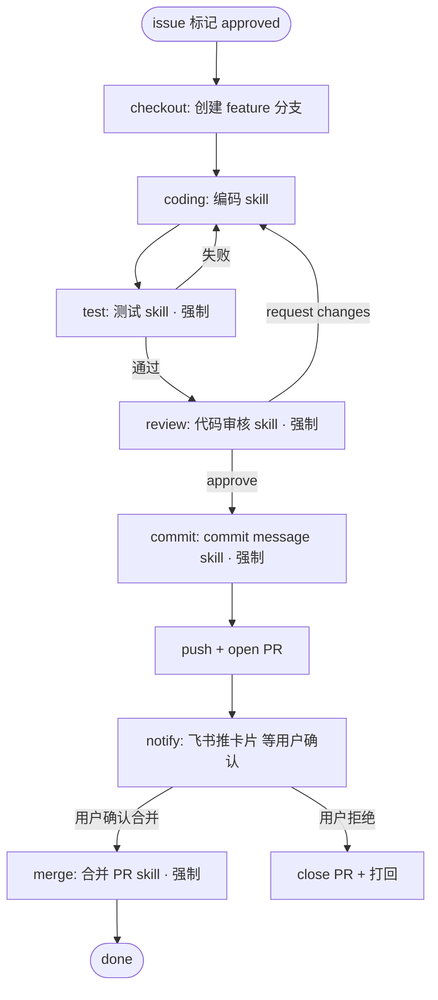

# IM 驱动的多 Agent 自动开发工作流设计

> 一句话摘要：用户在飞书里提需求 → 系统转成 GitHub issue → 审核人标记"可开发" → Agent 自动开发（编码 → 测试 → 审核 → commit → 开 PR）→ 用户确认合并 PR。全程由 Mastra workflow 编排，每个质量闸门都是「强制执行的 skill」（Mastra 原生 Agent Skills），git 全链路走 Conventional Commits + 语义化版本。**开工前先定义 `agent.md` 固化协作约定，Mastra 用原生 skills 机制落地 6 个闸门 skill。**

## 一、定位与背景

这是「实习生产品迭代工具」（见 10-实习生产品开发工具设计文档）的**工程外壳**：10 号文档管"产品怎么迭代"（PRD→原型→代码），本文档管"需求怎么流转 + Agent 怎么自动开发 + git 怎么规范"。

**核心区别**：
- 10 号文档 = 产品迭代**内核**（中间产物可控：PRD / 原型 / 代码）
- 本文档 = 工程协作**外壳**（需求生命周期 + 自动开发流水线 + git 规范）

两者可组合：一个需求的"自动开发"环节，既可以走 10 号的产品迭代流程（复杂 UI 需求），也可以直接编码（纯后端/修 bug）。本文档先聚焦"直接编码"这条主线。

## 二、已锁定决策

| 决策项 | 结论 |
|--------|------|
| 技术底座 | **Midway.js**（轻量集成：`@App() app` + `onReady()` 挂 `@mastra/koa` 的 `MastraServer`） |
| 编排框架 | **Mastra**（workflow + agent，TS-native） |
| IM 入口 | **飞书**（WebSocket 长连接，免公网 IP/备案，前期单人零门槛） |
| IM 架构 | 纯 Mastra + 自建轻量 IM adapter（不引入 Hermes） |
| 托管平台 | **GitHub**（需求 = issue，开发 = PR） |
| 仓库形态 | **单仓库** |
| 版本规范 | **Conventional Commits + 语义化版本（semver）+ 自动 changelog** |
| 协作模式 | 规范按多人设计，前期执行先按单人放开 |
| 编码执行 | **Mastra 控全流程 + 强制 skill 节点**；编码环节前期用 Mastra agent，预留「受控 Claude Code 工具」升级路径 |

## 三、核心架构决策

### 决策 1：编码用 Mastra 自己控，而非委托 Claude Code（决定性约束）

用户硬需求：**"每个步骤必须执行某个 skills"**。这是**确定性编排**需求。

关键洞察：测试 / 审核代码 / 合并 PR / commit message 这 4 个 skill **没有一个是"写代码"**，全是质量闸门 + git 操作。所以"强制执行 skill"的落点不在"谁写代码"，而在"谁编排流程"。

| 维度 | Mastra 自己控流程 | 委托 Claude Code headless |
|------|------------------|--------------------------|
| "每步必跑 skill" | ✅ 每个 skill = 不可跳过的 workflow 节点 | ❌ 自主循环，外部无法硬保证内部每步执行指定 skill |
| 质量闸门 | ✅ 由 Mastra 强制 | ✅ 同样由 Mastra 强制（编码后） |
| 编码质量 | 中等（缺深度 repo 上下文/LSP） | 高（读大代码库、精确编辑） |
| 可观测/回放 | ✅ Mastra Studio | ⚠️ 黑盒，需额外接 |

**结论**：
1. 所有质量闸门 skill（测试/审核/commit/合并）→ 100% 由 Mastra workflow 节点强制，不可跳过。
2. "写代码"这一步：前期用 Mastra 自己的 agent + 编码工具（确定性最强）；遇到编码质量瓶颈后，把 Claude Code 包成「受控 Mastra 工具」——Mastra 传"需求+约束"，Claude Code 返回"改动 diff+测试结果"，质量闸门仍归 Mastra。

> 一句话：确定性编排是 Mastra 的 workflow 图，不是自主循环。主控权在 Mastra，Claude Code 只是"编码环节的可替换工具"。

### 决策 2：飞书，因长连接模式消灭了前期成本

查证结论（2026-03 官方文档）：

| | 飞书 | 企业微信 | 个人微信 |
|---|---|---|---|
| 接入方式 | **WebSocket 长连接，免公网 IP/域名/备案**，本地/内网直接跑 | HTTP 回调，必须公网 IP + 备案域名 + 可信 IP 白名单 + AES 加解密 | 无官方 API（第三方属灰产，封号风险） |
| 官方 SDK | Node.js SDK 原生支持长连接 | 有（回调模式） | — |
| 交互 | 卡片消息 + 按钮回调（`card.action.trigger`） | Markdown/图文 | — |

决定性理由：前期单人核心诉求是"先把闭环跑通"，飞书长连接**不需要公网服务器和域名备案**，本地起 Midway 服务接 WebSocket 就能收发消息；企微卡在"备案域名 + 公网 IP"这个最贵门槛上。飞书卡片按钮回调天然适配"批准/拒绝/合并"交互。

### 决策 3：需求用 GitHub issue，状态用 label 承载

前期最简方案：**issue + label 状态机**（不引入 Projects，降低复杂度）。

```
open（新需求，待审核）
  ├─ approved（审核通过，可开发）   [label: approved]
  │     └─ in_progress（开发中）    [label: in_progress]
  │           └─ pr_opened（PR 已开）[label: pr_opened]
  │                 ├─ merged（合并） / rejected（用户拒绝）
  └─ rejected（审核拒绝）           [关闭 issue]
```

"审核人标记可开发"这个动作，既可以走 IM 卡片按钮（打 label + 触发 workflow），也可以直接在 GitHub 打 label（webhook 触发）。前期用 IM 卡片按钮，体验更顺。

## 四、整体架构

```mermaid
flowchart LR
    U[用户/实习生] -->|@机器人 提需求 / 点按钮| FS[飞书 Bot]
    FS <-->|WebSocket 长连接| MA[Midway IM Adapter]
    MA -->|解析命令 / 卡片回调| MW[Mastra Workflow]
    MW -->|创建 issue / 打 label / 开 PR / 合并| GH[GitHub API]
    MW -->|步骤调度| AG[Mastra Agents]
    AG -->|调用| SK[Skills 库]
    SK -->|编码/测试/审核/commit| REPO[目标代码仓库]
    MW -->|推卡片反馈| MA
    MA --> FS
    FS --> U
```

**分层职责**：
- **Midway**：HTTP/长连接壳 + 业务路由 + 鉴权，把飞书事件转成内部 `InboundMessage`。
- **Mastra**：workflow 编排 + agent + skill 调度（确定性主轴）。
- **Skills 库**：可插拔能力单元，每个质量闸门一个 skill。
- **GitHub**：需求（issue）+ 代码托管（PR）+ 合并。

## 五、飞书 IM 交互设计

### 5.1 接入方式

- 飞书开放平台 → 创建**企业自建应用** → 开启机器人能力。
- 事件订阅选**长连接模式（WebSocket）**：本地/内网即可收发，免公网。
- 核心权限：`im:message`（收发）、`im:message.group_at_msg`（群聊@）、`im:message.p2p_msg`（私聊）。
- 订阅事件：`im.message.receive_v1`（收消息）、`card.action.trigger`（卡片按钮回调）。
- **3 秒约束**：长连接收到事件后 3 秒内处理完，否则重推——所以 IM adapter 只做"收→投递"，重活异步丢给 Mastra，立即返回。

### 5.2 命令与卡片（前期单人，命令式交互）

| 用户动作 | 交互方式 | 系统行为 |
|---------|---------|---------|
| 提需求 | @机器人 "我要一个 XXX 功能" | 需求解析 skill → 创建 issue → 回卡片（issue 号 + 预览） |
| 看待审核需求 | @机器人 `/list` | 回待审核 issue 列表卡片（每个带"✅可开发 / ❌拒绝"按钮） |
| 批准开始 | 点卡片"✅可开发"按钮 | 打 label `approved` → 触发 Mastra workflow 自动开发 |
| 确认合并 | 点开发完成卡片"🔀合并 / ❌拒绝"按钮 | 合并 PR skill 执行 / 关闭 PR |

卡片按钮回调走 `card.action.trigger`，`callback_id` 内嵌业务标识（如 `approve_123`、`merge_456`），长度 ≤128、仅字母数字下划线短横线。

## 六、Mastra Workflow 步骤



**关键特性**：
- `test` / `review` / `commit` / `merge` 是**强制节点**，不可跳过，不通过不可进下一步。
- `test` 失败 → 条件边回到 `coding` 重做；`review` request changes → 同样回 `coding`。
- `merge` 依赖**用户确认**（关卡），用 suspend/resume 等人工信号。

## 七、Skills 清单（输入/输出边界）

| Skill | 触发时机 | 强制 | 输入 | 输出 |
|-------|---------|------|------|------|
| 需求解析 skill | IM 收到消息 | ✅ | IM 文本 | 结构化需求 → issue title/body |
| 编码 skill | issue 标记 approved | ✅ | issue 内容 + 代码库 | 代码改动（工作区 diff） |
| 测试 skill | 编码完成 | ✅ | 改动 diff | 测试结果（通过/失败 + 报告） |
| 代码审核 skill | 测试通过 | ✅ | 改动 diff | review 结论（approve / request changes + 意见） |
| commit message skill | 审核通过 | ✅ | 改动 diff + issue 号 | Conventional Commits 格式 message |
| 合并 PR skill | 用户确认 | ✅ | PR 号 | 合并结果 |

**skill 接入方式**（已更新，见 十一、Mastra Skills 机制与清单）：Mastra 1.x **原生支持 Agent Skills 规范**（`SKILL.md`），直接 `Workspace({ skills: ['skills'] })` 文件系统发现 + agent 自动获得 `skill`/`skill_read`/`skill_search` 三个工具，**不再需要「prompt + 工具」或绕道 MCP**。每个质量闸门 skill 的 SKILL.md 落位与结构见 §11.5。

**4 个坑**（沿用 10 号 §6.4）：① 写清晰 `description` 让 Agent 能发现选择（Agent Skills 规范要求，agent 靠 description 判断何时加载）；② 输出结构化；③ 绑定锁定版本（skill 目录纳入 git，改动走版本历史）；④ 不因"用了 skill"跳过人工把关（尤其 merge 必须用户确认）。

## 八、一整套 Git 规范

### 8.1 分支模型

- **trunk-based + 短期 feature 分支**：`main` 为主干，每个需求开一个短命 feature 分支，合并后即删。
- 分支命名：`feat/<issue-number>-<short-slug>`，如 `feat/123-user-login`。

### 8.2 Commit 规范（Conventional Commits）

```
<type>(<scope>): <subject>

[body]

Closes #<issue-number>
```

- `type`：`feat` / `fix` / `refactor` / `test` / `docs` / `chore` / `perf`
- `scope`：单仓库模块名（可选）
- `subject`：祈使句、≤50 字符
- 末尾关联 issue：`Closes #123`
- **生成 + 校验双层**：commit message skill 生成 → `commitlint` 兜底硬卡（格式不对拒绝 commit）

### 8.3 PR 流程

- 方向：feature → `main`
- 标题：`<type>: <subject> (#<issue>)`
- body 自动生成：改动摘要 + 测试结果 + review 结论
- 关联：`Closes #123`（合并后自动关闭 issue）

### 8.4 Merge 策略

- 前期单人：**squash merge**（`main` 保持线性干净历史）。
- 多人后：保留 squash（或按团队偏好切 merge commit），由 CI 门禁 + 有权限者确认。

### 8.5 Tag / Release / Changelog

- 语义化版本 `vMAJOR.MINOR.PATCH`：`feat`→minor、`fix`→patch、`BREAKING CHANGE`→major。
- 自动 changelog：`conventional-changelog`（或 `release-please`）根据 commit 历史生成。

### 8.6 Agent 操作 Git 的约束（关键红线）

1. Agent **只能操作自己的 feature 分支**。
2. **禁止 push / force push `main`**；禁止 rebase `main`。
3. 所有提交必须**过测试 + 审核 skill**，否则不许 commit。
4. **合并必须用户确认**（前期）或 CI 门禁 + 有权限者批准（多人后）。
5. commit message 必须过 `commitlint`，格式不合规直接拒。

## 九、多人化演进（前期单人 → 目标多人）

| 维度 | 前期单人 | 多人 |
|------|---------|------|
| `main` 保护 | 可放宽（自己 push 也行，但 Agent 仍走 PR 流程养习惯） | 强制保护 + 至少 1 人 review |
| 合并 | 用户点卡片确认 | CI 门禁（test+lint+commitlint）通过 + 有权限者批准 |
| 审核人 | 同一个人 | "审核需求"角色多人化（可多人 review） |
| issue 状态机 | 不变 | 不变（只是审核人从 1 人变多人） |
| 权限 | 单人 token | GitHub App + 最小权限 + 操作审计 |

**关键：规范一次按多人设计，前期只放宽"保护/确认"两个执行点，避免后期返工。**

## 十、项目启动前置：agent.md 约定（开工第一件事）

> **开工前先定义 `agent.md`，把协作约定提前固化，而不是等项目跑起来再补。** 这是本项目区别于"先写代码再说"的关键纪律。

### 10.1 为什么必须前置定义 agent.md

agent.md 是**给所有参与本项目的智能体（AI 助手 / 编码 agent / Mastra 里的 agent）看的常驻指令**，写清楚"本项目怎么干、约定是什么、红线在哪"。前置定义的原因：

1. **约定是"共识"，不是"事后记录"**：git 规范、skill 边界、状态机、权限红线如果等项目跑起来才补，前期的代码和 workflow 已经带着临时约定，返工成本高。
2. **agent 是"无记忆"的**：每个会话/每次 workflow 执行都是新的，只有一份持久化的 agent.md 能让不同 agent、不同会话读到同一套约定。
3. **多人协作的基础**：多人（或多 agent）并行开发时，agent.md 是唯一可靠的"共享大脑"。

### 10.2 agent.md 应该放哪、长什么样

- **落点**：目标代码仓库根目录的 `agent.md`（和 `README.md` 同级）。
- **结构**：不追求大而全，聚焦"能约束行为"的部分。参考本知识库自身的 `agent.md`（`/Users/yutingguo/Documents/code/tim.vault/agent.md`）风格——简短、可执行、不啰嗦。

### 10.3 本项目 agent.md 的推荐骨架

```markdown
# agent.md — 本仓库智能体规范（常驻指令）

> 所有在本仓库运行的智能体（编码 agent / Mastra agent / 任意 AI 助手）开工前先读本文件。

## 1. 仓库本质
- TypeScript + Midway.js 工程，Mastra 编排多 agent 自动开发。
- 主线：飞书收需求 → GitHub issue → Mastra 自动开发 → PR 合并。

## 2. 技术栈与结构
- 后端：Midway.js（Koa 底座），Mastra 通过 @mastra/koa adapter 挂载。
- 编排：Mastra workflow + agent + skills。
- 需求状态：GitHub issue + label（open/approved/in_progress/pr_opened/merged/rejected）。

## 3. Git 规范（硬约束，不可违反）
- 分支模型：trunk-based + 短期 feature 分支 `feat/<issue-number>-<slug>`。
- commit：Conventional Commits，`<type>(<scope>): <subject>`，末尾 `Closes #<issue>`，必须过 commitlint。
- 红线：只操作自己的 feature 分支；禁止 push/force push main；禁止 rebase main。
- 合并：squash merge 到 main，必须有用户确认（前期）。

## 4. Skill 使用约定
- 每个质量闸门（测试/审核/commit/合并）都是一个 Mastra skill，**不可跳过**。
- skill 见 `src/mastra/skills/`，格式遵循 Agent Skills spec（SKILL.md）。
- 编码由 Claude Code 经 Mastra SDK 嵌入执行，Mastra 只负责编排与闸门。

## 5. 沟通与状态反馈
- 需求状态变更必须同步到 GitHub issue label + 飞书卡片。
- 所有对外动作（创建/合并 PR）都要可追踪、可回滚。

## 6. 不要做的事
- 不要绕过 workflow 直接改 main / 直接合并 PR。
- 不要在代码里硬编码密钥（用 env / secret 管理）。
- 不要删除或破坏 agent.md 与 git 规范约定。
```

### 10.4 定义 agent.md 的时机与流程

```
① 仓库初始化（git init + 目录结构）
② 先写 agent.md（上面骨架，按实际裁剪）
③ 再搭 Mastra workflow 和 skills（因为 skill 边界、状态机都依赖 agent.md 里的约定）
④ 最后接飞书 adapter
```

**核心原则：agent.md 是"上游"，代码和 workflow 是"下游"。先定约定，再写实现。**

---

## 十一、Mastra Skills 机制与清单

### 11.1 Mastra 原生支持 skills（重要更正）

> 之前 §7 写"skill 用 prompt + 工具轻量实现，跑通后迁 MCP"——**查证（Mastra 官方文档）后更正：Mastra 1.x 已原生支持 Agent Skills 规范，不需要绕道 MCP 或自造 prompt+工具。** skill 就是一等公民。

Mastra 的 skill 遵循 **Agent Skills 规范**（`SKILL.md` + YAML frontmatter），是一种"可复用指令包"，教 agent 如何做特定任务。skill 是目录，包含：

```
skill-name/
├── SKILL.md          # 必需：frontmatter（name/description）+ 指令正文
├── references/       # 可选：补充文档（风格指南、检查清单等）
├── scripts/          # 可选：可执行脚本（lint、测试等）
└── assets/           # 可选：静态资源
```

**SKILL.md frontmatter 必需字段**：`name`（小写字母数字连字符，1-64 字符，须匹配目录名）、`description`（描述做什么 + 何时用，agent 靠它发现和选择 skill）。

### 11.2 两种挂载方式

| 方式 | 语法 | 适用 |
|------|------|------|
| **agent 级**（代码内联） | `skills: [createSkill({...})]` 或传 `./skills/xxx` 路径 | skill 归属特定 agent，定义在代码里，无需 workspace |
| **workspace 级**（文件系统发现） | `new Workspace({ skills: ['skills'] })` | 从文件系统发现，跨所有 agent 共享 |

本项目推荐 **workspace 级**：`skills/` 目录放所有质量闸门 skill，所有 agent 都能发现，符合"质量闸门全局强制"的诉求。

### 11.3 三个 skill 工具（agent 怎么用 skill）

配置 skills 后，agent 自动获得三个工具：

| 工具 | 作用 |
|------|------|
| `skill` | 加载某个 skill 的完整指令（agent 需要时按需加载） |
| `skill_read` | 读 skill 的 `references/`、`scripts/`、`assets/` 里的文件 |
| `skill_search` | 跨所有 skill 内容搜索（BM25 / 向量 / 基础文本匹配） |

**无状态设计**：skill 指令若被上下文窗口压缩挤出，agent 可再调 `skill` 重新加载，不需要"激活状态"追踪。

### 11.4 与本 workflow 的关系（重要澄清）

之前 §六 把"强制 skill"画成 workflow 节点，这里需要理清**两层 skill 语义**：

```
Mastra Workflow（确定性编排，硬控流程）
   └── 每个 step 里：调 agent，agent 可能按需加载 skill
         └── skill（教 agent "怎么做"，不是硬编码流程）
```

- **Workflow 节点**：`coding` / `test` / `review` 这些是**流程控制**（谁先谁后、失败回退）——由 workflow 图硬编码，**不可跳过**。
- **Skill**：教 agent"每个环节具体怎么做"（测试测什么、审核查什么、commit message 怎么写）——由 agent 按需加载。

**两者互补，不冲突**：workflow 保证"顺序和强制"，skill 保证"质量和方法"。一个需求"必须跑测试 skill"= workflow 里 `test` 节点强制调 agent，agent 加载 `code-testing` skill 来执行。

### 11.5 6 个 skill 的 SKILL.md 化设计

把 §7 的 skill 清单，落到 Agent Skills 规范的目录结构。每个 skill 一个 `src/mastra/skills/<name>/SKILL.md`：

```
src/mastra/skills/
├── requirement-parser/    # 需求解析
│   └── SKILL.md
├── coding/               # 编码（委托 Claude Code）
│   └── SKILL.md
├── code-testing/         # 测试闸门
│   ├── SKILL.md
│   └── references/
│       └── test-checklist.md
├── code-review/          # 代码审核闸门
│   ├── SKILL.md
│   └── references/
│       └── review-checklist.md
├── commit-message/       # commit message 生成
│   └── SKILL.md
└── merge-pr/            # 合并 PR 闸门
    └── SKILL.md
```

**每个 SKILL.md 的核心结构**（以 `code-review` 为例）：

```markdown
---
name: code-review
description: 审核代码质量、风格、潜在问题。测试通过后必须执行，不通过不可进入 commit。
version: 1.0.0
tags: [development, review]
---

# Code Review
你是代码审核员。审核代码改动时：
1. 检查正确性与边界情况
2. 核对是否遵循仓库风格（见 references/review-checklist.md）
3. 排查 bug / 安全隐患 / 性能问题
4. 跑 lint（scripts/）

## 输出
- approve：可进入 commit
- request changes：附具体意见，打回 coding 重做
```

### 11.6 同名冲突与优先级

若多个目录有同名 skill，按来源类型取优先级：**agent 级 > workspace 本地 > `.mastra/` > `node_modules/`**。本项目只用 workspace 本地一个来源，无需处理冲突。

### 11.7 skills 与 workflow 的装配示意

```ts
// src/mastra/skills.ts（workspace 级，文件系统发现）
import { Workspace, LocalFilesystem } from '@mastra/core/workspace'
export const workspace = new Workspace({
  filesystem: new LocalFilesystem({ basePath: './src/mastra' }),
  skills: ['skills'],   // 发现 src/mastra/skills/ 下所有 SKILL.md
})

// workflow 里强制调 agent，agent 自动能加载 skills
const testStep = new Step({
  id: 'test',
  execute: async ({ mastra }) => {
    const agent = mastra.getAgent('dev-agent')   // 配了 skills
    const result = await agent.generate(
      '运行 code-testing skill，对当前改动做完整测试，报告通过/失败'
    )
    return { testResult: result.text }
  },
})
```

---

## 十二、下一步待细化

- **每个 skill 的具体实现**：把 §11.5 的 6 个 SKILL.md 写完整（含 references/ 检查清单）
- **Mastra workflow 的 step 代码骨架**：coding → test → review → commit → PR 的可运行 TS 代码
- Midway IM adapter 的飞书事件解析与长连接初始化代码
- Claude Code 经 Mastra SDK 嵌入的具体配置（`ClaudeSDKAgent`）
- GitHub App 鉴权（多人阶段）

## 关联

- 10-实习生产品开发工具设计文档 — 产品迭代内核（PRD→原型→代码）
- 01-多智能体框架全景与选型
- 03-LangGraph 详解：状态图编排
- 04-CrewAI 与 Mastra 对比
- 06-大厂官方 SDK 与 A2A 协议
- MCP 总览
