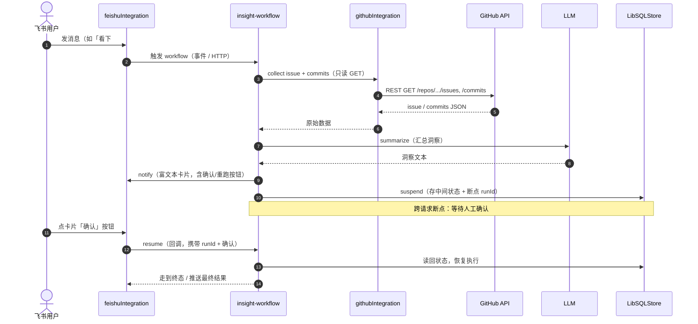

# M1 · 只读洞察闭环 — 数据流向图

> 本文件是 M1 里程碑卡的**数据流向图（时序图）**，用 Mermaid 绘制，展示「飞书消息 → 触发 workflow → collect → summarize → 卡片回推 → suspend → 人工 resume」的完整数据流向与跨请求断点。
> 卡片主体见 [`M1-只读洞察闭环.md`](./M1-只读洞察闭环.md)。

## 数据流向要点

- **触发 → 编排 → 集成 → 外部系统**：飞书消息经 `feishuIntegration` 触发 `insight-workflow`，workflow 通过 `githubIntegration` 拉取只读数据、调 `LLM` 汇总、再经 `feishuIntegration` 回推卡片。
- **跨请求断点（suspend/resume）**：step4 的 resume 是**全新 HTTP 请求**，仅持 `runId`；必须靠 `LibSQLStore` 把 step1–step3 上下文捞回。不配 storage 时 resume 必报 `This workflow run was not suspended`（实测见卡片 §4）。
- **只读不写远端**：全链路只发 GET，不写 issue、不写分支、不开 PR——满足 M1「完全不写目标仓库」的约束。
