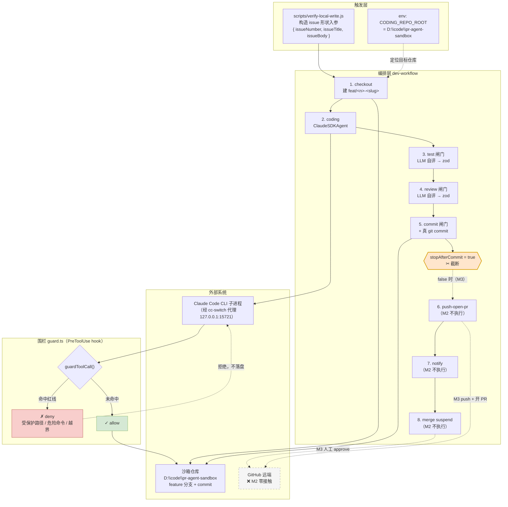
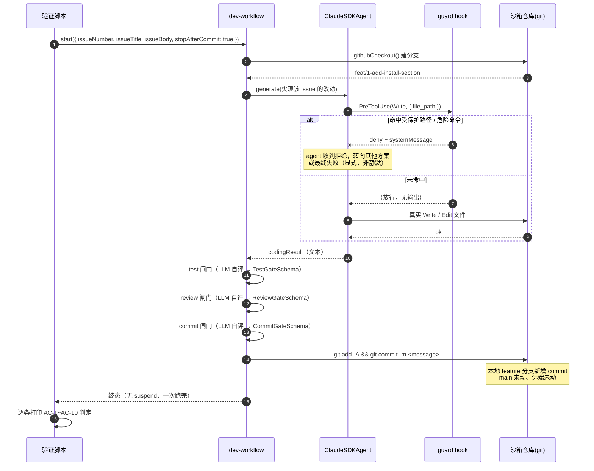
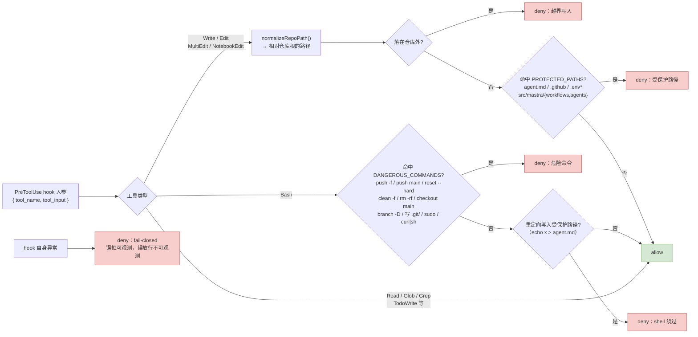

# M2 · 本地写入闭环 —— 数据流向图

> 配套卡片：[`M2-本地写入闭环.md`](./M2-本地写入闭环.md)
> 本图重点画三件事：**触发 → 编排 → 集成 → 外部系统**的数据走向、**guard 拦截点**、**零远端边界**。
> M2 **没有 suspend/resume 断点**（运行时无闸门），这是与 M1/M3 的关键差异，图里显式标注。

---

## 7.1 总览：M2 范围内的数据流向

**读图要点**

- **✂ 截断点是 M2 的核心编排改动**：`devWorkflow` 目前是 `.then()` 八步全串，不加截断就会真 push 或卡在 merge 的 suspend 上（M2-3）
- **guard 挂在 CLI 子进程内部**，不在 workflow 层 —— 它是唯一能拦住每一次工具调用的点（bypassPermissions 下 `canUseTool` 不生效）
- **虚线 = M3 才走的路径**，M2 全部不执行

---

## 7.2 时序：一次 M2 运行（含红线拦截时序）

---

## 7.3 围栏决策流（guard.ts 判定内核）

**这三类 deny 分别对应 AC-4 / AC-5 / AC-6**，是 M2 最该优先验证的部分 —— 它们证明的是「失控时拦得住」，而非「功能能用」。

---

## 7.4 与 M1 / M3 的边界对比

| | M1（已完成） | **M2** | M3（待开始） |
|---|---|---|---|
| 入口 | 飞书 / HTTP | **脚本构造入参** | 飞书 / issue 事件 |
| 写目标仓库 | 否（只读 REST） | **仅本地分支** | 是（push + PR） |
| 运行时闸门 | suspend 在 confirm | **无**（跑完人工看） | suspend 在 merge |
| 远端接触 | 只读 API | **零** | push + merge |
| 本图新增关注点 | suspend/resume 断点 | **guard 拦截点 + 零远端边界** | merge 人工 approve |
