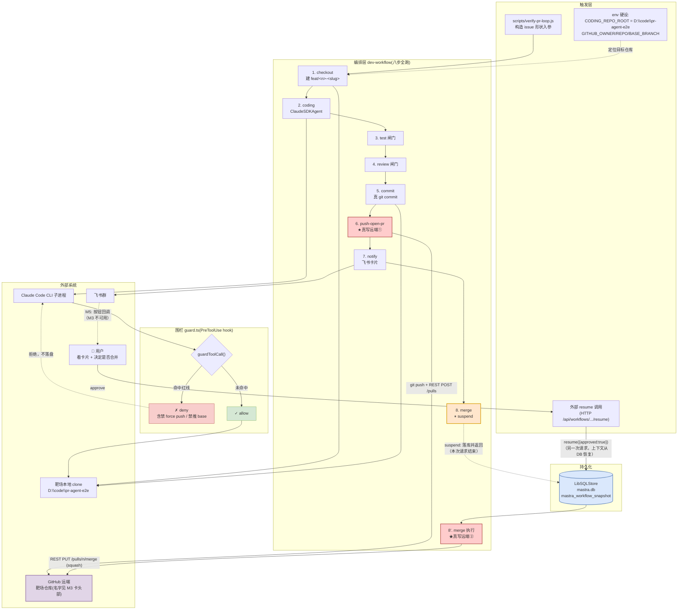
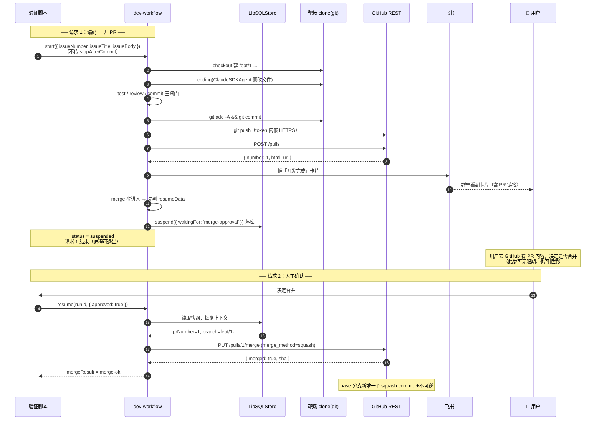
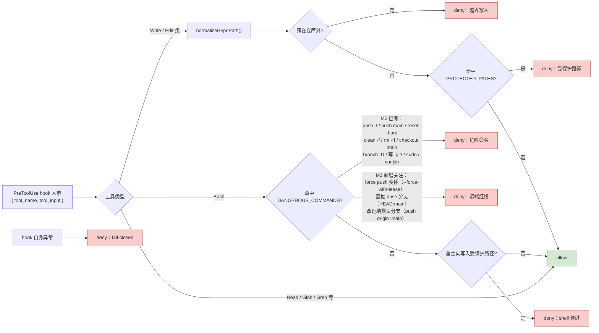

# M3 · 完整 PR 闭环 —— 数据流向图

> 配套卡片：[`M3-完整PR闭环.md`](./M3-完整PR闭环.md)
> 本图重点画三件事：**suspend/resume 跨请求断点**（M2 完全没有、M1 有）、**人工闸门的位置**、**远端写入路径与红线拦截点**。
> 与 M2 的关键差异：**虚线不再是「M3 才走」而是实线**；`stopAfterCommit` 不再传，八步全跑。

---

## 1 总览：M3 的数据流向

**读图要点**

- **★ 两个红色节点是「不可逆写入」**：① 开 PR（可关闭，代价低）② squash merge（**base 分支多一个 commit，这才是真正不可逆的**）。M3 的全部设计都围绕「② 之前必须有人点头」
- **蓝框是 M3 首次启用的机制**：`suspend` 时把 workflow 快照落库，本次 HTTP 请求就结束了；人工 approve 后是**另一次请求**，上下文必须从库里恢复。M2 因为 `stopAfterCommit=true` 在 suspend **之前**就 return，这条链路**从未被执行过** —— 这是 M3 最高风险项
- **橙色是人工闸门**：位置在 merge 步的最前面，`suspend` 之前不做任何副作用
- **飞书卡片是「单向通知」**：M3 只推不收。卡片上的按钮点击会因缺少 inbound 而无效（M5），故卡片文案必须如实说明

---

## 2 时序：一次 M3 运行（含跨请求断点）

**读图要点**

- **两条竖线之间的 `Note` 就是「跨请求断点」**：请求 1 结束后进程可以退出，请求 2 带着 runId 回来。这要求 workflow 上下文可序列化 —— 这正是 `ContextSchema` 里所有字段都是简单类型（string / number / 嵌套的小对象）的原因，**不要往里面塞大对象或函数**
- **「先判 resumeData，再 suspend」的顺序不能反**：若先 suspend 再判，人工 approve 后恢复时又会走到 suspend，形成**永远点不掉的挂起**
- **拒绝也是一条合法路径**：`resume({approved:false})` 时不应执行 merge，PR 保持 open 留给人工处理（AC-5）

---

## 3 红线：M3 在远端维度上加了什么

**为什么远端红线在 M3 才成为重点**：M2 的沙箱仓库**没有 remote**，`git push` 物理上不可能成功 —— 危险命令表里的 `push -f` 拦不拦得住，**没有真实后果可验证**。M3 接上真远端后，「推错分支 / 强推覆盖历史」第一次成为**会造成真实损失**的操作（AC-8 由此升级为必需项）。

---

## 4 与 M1 / M2 的边界对比

| | M1（已完成） | M2（已完成） | **M3（本卡）** |
|---|---|---|---|
| 入口 | 飞书 / HTTP | 脚本构造入参 | **脚本构造入参**（inbound 仍缺，M5） |
| 写目标仓库 | 否（只读 REST） | 仅本地分支 | **push + 开 PR + merge** |
| 运行时闸门 | suspend 在 confirm | **无**（跑完人工看） | **suspend 在 merge** |
| 人工闸门位置 | 编排层 | 里程碑层 | **编排层** |
| 远端接触 | 只读 API | **零** | 写（push / PR / merge） |
| 跨请求恢复 | ✅ 已验证 | ❌ 未走（被截断跳过） | **✅ 本里程碑首次验证** |
| 不可逆操作 | 无 | 无 | **squash merge** |
| 本图新增关注点 | suspend/resume | guard 拦截点 + 零远端边界 | **跨请求断点 + 人工闸门 + 远端红线** |
