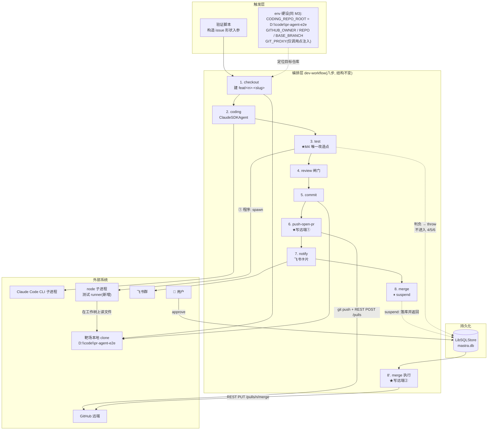
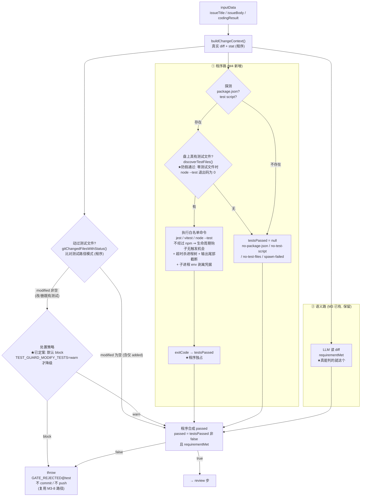
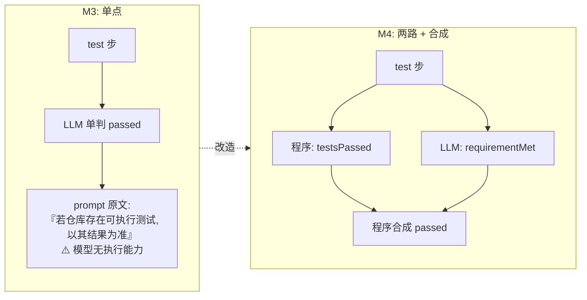

# M4 · 真质量闸门 —— 数据流向图

> 配套卡片：[`M4-真质量闸门.md`](./M4-真质量闸门.md)
> 本图重点画三件事：**test 步内部从「单点」变「两路」**、**三态走向（pass / fail / null）**、**判负终止点**。
> 与 M3 的关键差异：编排层八步**结构不变**，变的只是 **test 步内部的判据来源**。

---

## 1 总览：M4 的数据流向

> **读图要点**：M4 对编排层**没有改动** —— 八步、suspend 断点、红线位置全部沿用 M3。
> 唯一的改造发生在 `C3` 这个方框**内部**。这是可以在图上直观确认的「范围没有蔓延」。

---

## 2 test 步内部：两路分叉与汇合（M4 的核心）

### 三态走向（务必分清）

| `testsPassed` | 含义 | 对 `passed` 的影响 |
|---|---|---|
| `true` | 真跑了，退出码 0 | 由 `requirementMet` 决定 |
| `false` | 真跑了，退出码非 0 / 超时 | **直接判负**（硬红线，`requirementMet` 不参与） |
| `null` | **无测试可跑 / 无测试文件 / runner 起不来** | 由 `requirementMet` 决定，但 `report` 必须标注「未跑测试」 |

> ⚠️ **`null` 绝不能被当成 `true`**。「没有测试」与「需求实现了」是两件不同的事。
> 这正是 M2 那次 `lintPassed` 幻觉的同构错误：让 LLM 回答一个不存在的事实。
>
> ⚠️ **另一条更隐蔽的假通过**（2026-09-15 实测暴露，不在原计划内）：
> `node --test` 在「零个测试文件」时**退出码为 0**。若只看退出码，
> 「声明了测试但仓库里其实没有测试」会得到 `testsPassed=true` —— 什么都没验，却报了绿。
> 已在 runner 前加 `discoverTestFiles()` 盘上发现性检查，此时判 `null`。

### `modified` vs `added`（为什么不是单一布尔）

| 情况 | git 状态 | 归类 | 处置 |
|---|---|---|---|
| 改 / 删 / 重命名**既有**测试 | `M` / `D` / `R` | `modified` | **默认阻断**（能把断言改松 → 自证循环） |
| **新增**测试文件 | `A`（含未跟踪） | `added` | 仅记录（不可能削弱既有断言） |

> 不拆的话，一个「顺手给新函数补个测试」的良性 agent 会被误拦 ——
> 而这恰是靶场路径 A 的真实风险（模型很可能觉得补测试是好习惯）。

---

## 3 判据来源对照（M3 → M4）

---

## 4 与 M3 的差异速查

| 维度 | M3 | M4 |
|---|---|---|
| 编排层八步 | 完整 | **不变** |
| `test` 步内部 | 单点（一次 LLM 调用） | **两路（程序执行 + LLM 语义）+ 合成** |
| `passed` 的来源 | LLM | **程序合成** |
| 「测试过没过」 | LLM 编造 | **程序真跑取 exit code** |
| 无测试时的语义 | 混在 `passed` 里，无区分 | **`testsPassed = null`（不等于 true）** |
| agent 改测试 | 无感知 | **`agentModifiedTests` 标记 + 默认阻断**（`added` 不阻断） |
| 命令来源 | LLM 声称跑过 | **程序白名单 runner，完全不经过 npm** |
| 闸门重试 | 盲（不回灌错误） | **回灌上次 zod 错误（P0-2）** |
| 人工闸门 | merge 前 suspend | **不变**（M4 的判据不需人批） |
| 红线 / 靶场 | `wintim1143/pr-agent-e2e` | **不变，且新增被测文件 `src/greet.js` + 人工预置测试** |
| 验证脚本 | `verify-pr-loop.js`（M3，已归档） | **新增 `verify-m4-gate.js`**（有意隔离，不动 M3 的证据产出器） |
