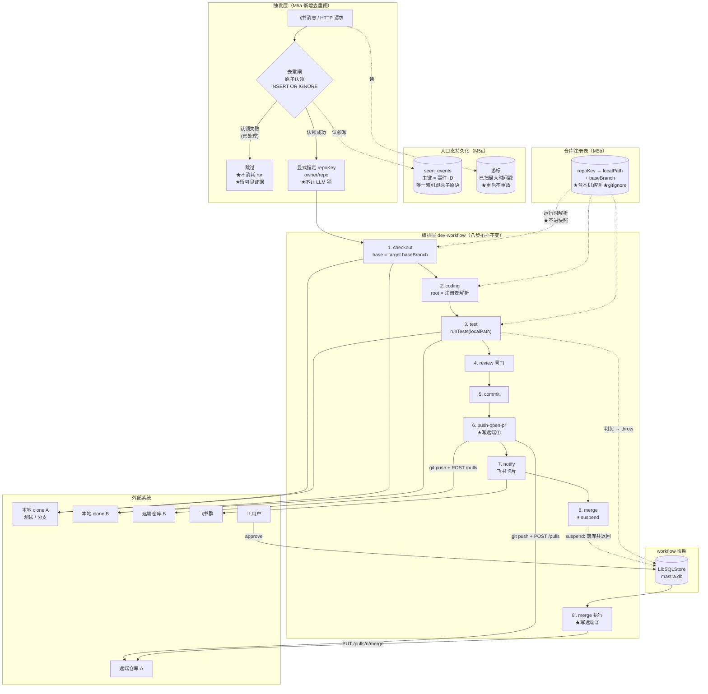
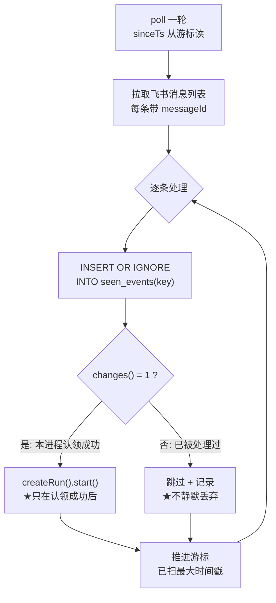
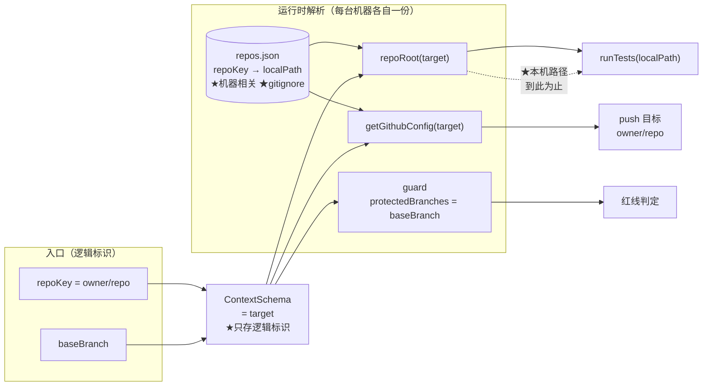
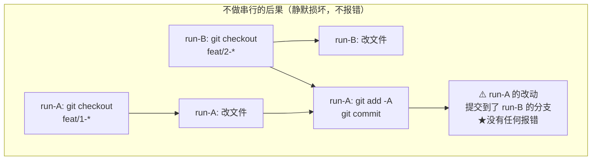

# M5 · 多仓库与幂等 —— 数据流向图

> 配套卡片：[`M5-多仓库与幂等.md`](./M5-多仓库与幂等.md)
> 本图重点画三件事：**入口层新增一道去重闸**、**一条 target 贯穿全部八步**、**本机路径不进快照**。
> 与 M4 的关键差异：M4 的改造收敛在 test 一个方框**内部**；M5 是**两条横切**（入口拦一道 + 全链路多一个字段），
> 但**编排层八步的拓扑仍然不变**。

---

## 1 总览：M5 的数据流向

> **读图要点**：
> 1. **八步的方框与连线一个没改** —— M5 对编排层拓扑零改动（与 M4 的「结构不变」是同一个可验证断言）。
> 2. **`target` 只落在两个地方**：入口（显式指定 repoKey）与快照（逻辑标识）。**本机路径只在「仓库注册表 → 方框」的虚线里流动**，
>    这条虚线是运行时解析，**不经过快照** —— 图上用「★不进快照」标注，这是 M5b 最容易做错的地方。
> 3. 新增的持久化是**入口态**（`seen_events` / 游标），与 **workflow 运行态**（`mastra.db` 的 snapshot）语义不同，
>    图上分成两个子图就是为了让这条边界可见（是否同库不同表见卡 §0 待拍板项 1）。

---

## 2 入口层：去重闸的原子认领（M5a 的核心）

### 为什么必须是 SQLite 而不是 JSON / 内存 Map

| 方案 | 有原子性？ | 结论 |
|---|---|---|
| 内存 `Map` / `Set` | ❌ | 进程重启即失效；两个 poll 进程各有一份 |
| JSON 文件 | ❌ | 「读-判断-写」之间有窗口，两个并发 poll 会**都认领成功** |
| **SQLite 唯一主键 + `INSERT OR IGNORE`** | ✅ | 单条语句完成「判断 + 占用」，**中间没有窗口** |

> 这是本里程碑里唯一一处**必须**依赖数据库语义的地方。判别标准很直白：
> 去重的正确性要求是「**并发下恰好一次**」，而这正是唯一索引存在的理由 —— 用别的东西模拟它就是在重新发明它。

### 为什么入口幂等仍然有价值（即使产物层已幂等）

| 层次 | 幂等键 | 现状 | 若只靠产物层兜底会怎样 |
|---|---|---|---|
| **入口层** | `messageId` | ❌ 缺口（M5a 补） | 重复的 run 会**重复跑 coding 与 review**（真金白银的 LLM 调用） |
| **产物层** | 分支 / PR head | ✅ M3 已做（`github.ts:611-617` 复用 open PR） | PR 不会重复，但**本地 clone 会被多个 run 争抢**（见下节） |

---

## 3 多仓库：target 的解析路径与「不进快照」边界（M5b 的核心）

### 为什么本机路径必须停在解析层

`ContextSchema` 会被**序列化进 `mastra.db` 的 snapshot**。M3-5 已实证「跨进程 resume 靠快照恢复上下文」
（另一进程用 `createRun({ runId })` 重建 run 后，仍能读到 `prNumber` / `branch` / `testResult` —— 只可能来自快照）。

若把 `localPath` 写进 schema：

| 场景 | 后果 |
|---|---|
| 换台机器 resume | 快照里是另一台机器的绝对路径 → 指向不存在的目录 |
| 同一台机器换了 clone 位置 | 同上 |
| 备份 / 迁移 `mastra.db` | 快照携带本机路径，语义上就错了 |

> 判别标准：**逻辑标识（owner/repo）是业务语义，跨机器稳定；本机路径是环境事实，随机器而变。**
> 把环境事实写进业务状态快照，等于让状态文件**绑定到某台机器的文件系统**。

---

## 4 并发：为什么需要「每仓库串行」（M5b-4）

> **根因**：`git checkout` 改变的是**整个工作树**的分支状态，它是**仓库级全局变量**，不是进程局部变量。
> 两个 run 对同一本地 clone 交替操作，就会出现「谁的 commit 落到谁的分支上」这类交错。
> 这不是并发 bug 的常见形态（它不崩溃、不报错），所以**必须靠判据显式验证**（卡 AC-8）。

| 方案 | 隔离强度 | 成本 | M5 取舍 |
|---|---|---|---|
| 不做任何处理 | ❌ | 0 | 否 —— 静默损坏 |
| **每仓库串行（互斥）** | 同一 repoKey 串行、不同仓库并行 | 低（需跨进程，倾向用 DB 锁行） | ✅ **M5 采用** |
| `git worktree` 每 run 一工作树 | 同一仓库也能真并行 | 高（每 run 一个工作树 + 清理 + 磁盘） | ❌ 明确留给后续（卡 §3） |

---

## 5 与 M4 的差异速查

| 维度 | M4 | M5 |
|---|---|---|
| 改造形态 | **收敛在一个方框内部**（test 步） | **两条横切**：入口加闸 + 全链路多一个字段 |
| 编排层八步拓扑 | 不变 | **不变**（同样可验证） |
| 新增模块 | 新建 adapter（`test-runner.ts`） | 新建 adapter（`dedup-store.ts` / `repo-registry.ts`） |
| 新增外部依赖 | 无 | 无（`@libsql/client` 已是传递依赖） |
| 仓库定位 | 全局 env（`CODING_REPO_ROOT`） | **per-target**（缺省回退 env，向后兼容） |
| 红线 | 全局 `GITHUB_BASE_BRANCH` | **per-target**（不改会静默失效） |
| 入口触发 | 手动 / 验证脚本 | + **去重闸**（幂等键 + 原子认领 + 游标） |
| 产物幂等 | 已存在（M3） | **回归保护**（补 AC 断言，不改实现） |
| 并发 | 串行跑，未暴露问题 | **必须显式处理**（每仓库串行） |
| 靶场 | 1 个（`pr-agent-e2e`） | **2 个**（多仓库必须有第二对象才有意义） |
| 验证脚本 | `verify-m4-gate.js`（已归档） | **新增 `verify-m5-multirepo.js`**（同样有意隔离） |
| 风险性质 | **假通过**（报告绿了但没验） | **静默损坏**（重复消耗 / 提交落错分支） |
