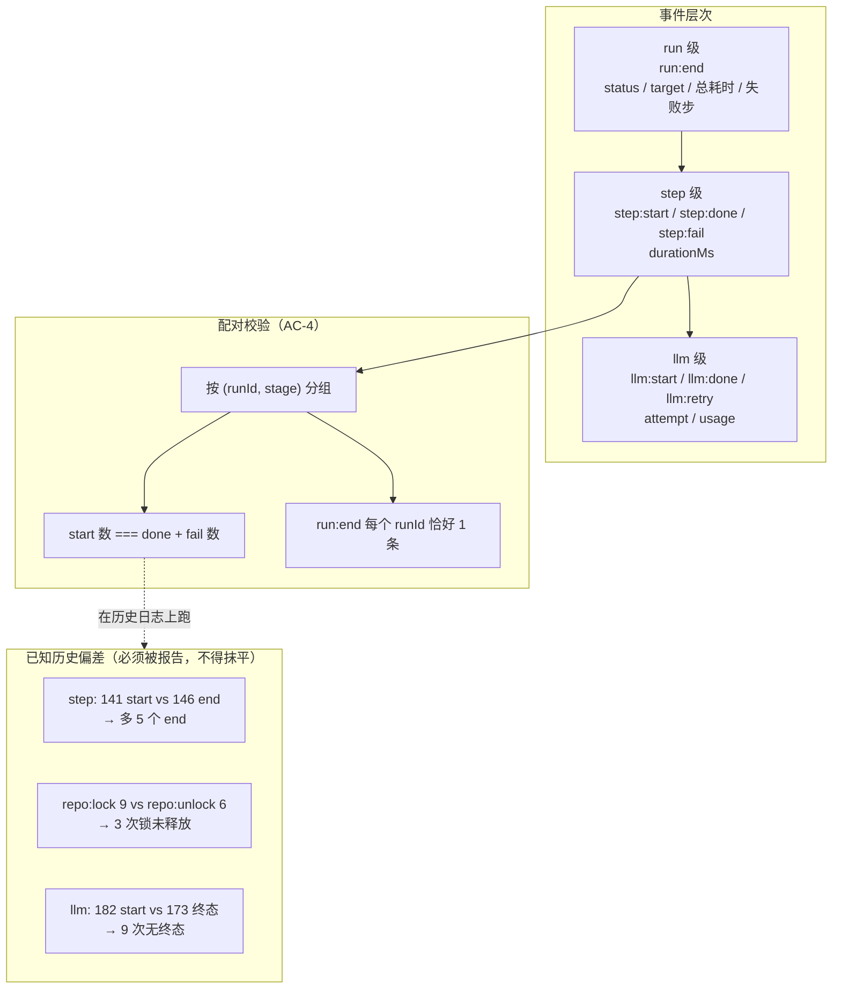

# M6 · 可观测与成本 —— 数据流向图

> 配套卡片：[`M6-可观测与成本.md`](./M6-可观测与成本.md)
> 本图重点画三件事：**runId 从哪来（Mastra 免费给）**、**事件从哪出（统一 logger 出口）**、
> **按 run 分组在哪发生（读取器 / 验证脚本）**。
> 与 M5 的关键差异：编排层八步**结构完全不变**，变的只是**事件的产生方式与关联方式**。

---

## 1 总览：M6 的数据流向

```mermaid
flowchart TB
    subgraph TRIGGER["触发层（与 M4/M5 相同，M6 不接飞书）"]
        V["验证脚本<br/>verify-m6-observability.js"]
        HTTP["HTTP 入口<br/>POST /api/insights"]
    end

    subgraph ORCH["编排层 dev-workflow（八步，拓扑不变）"]
        direction TB
        RUN["createRun()<br/>★ runId = Mastra 生成"]
        C1["1. checkout"]
        C2["2. coding"]
        C3["3. test"]
        C4["4. review"]
        C5["5. commit"]
        C6["6. push-open-pr"]
        C7["7. notify"]
        C8["8. merge ⏸ suspend"]
        C9["8'. merge 执行<br/>(resume 后)"]
    end

    subgraph CTX["★ M6-2 的取数点"]
        EX["每个 step 的 execute 上下文<br/>async (&#123; inputData, runId &#125;)<br/>—— runId 由 Mastra 提供"]
    end

    subgraph LOGGER["★ M6-1 统一日志出口"]
        L1["结构化记录（真源）<br/>ts / event / runId / traceId / stage / durationMs"]
        L2["console 镜像（只有人看的那一份）"]
    end

    subgraph SINK["★ M6-3 落盘与保留"]
        F1["logs/dev-workflow.log<br/>(单文件 + runId 字段)"]
        F2["logs/runs/&lt;runId&gt;.log<br/>(per-run 分片, 二选一)"]
        ROT["轮转 + 保留 N 份"]
    end

    subgraph READ["★ M6-5 读取与聚合"]
        Q["queryByRun(runId)<br/>按 run 重建时间线"]
        AGG["按 target.repoKey 聚合<br/>token / LLM 调用次数"]
        PAIR["(runId, stage) 配对校验<br/>start === done + fail"]
    end

    subgraph STORE["持久化（M6 不替换，只不再依赖其反查）"]
        DB[("LibSQLStore<br/>mastra_workflow_snapshot")]
        DEDUP[("pr_agent_seen_events<br/>事件→run 索引, M5 已建")]
    end

    V --> RUN
    HTTP --> RUN
    RUN --> C1 --> C2 --> C3 --> C4 --> C5 --> C6 --> C7 --> C8
    C8 -.->|人工 resume| C9
    RUN -.->|快照| DB
    RUN -.->|attachRunId 回填| DEDUP

    C1 & C2 & C3 & C4 & C5 & C6 & C7 & C9 --> EX
    C8 -.->|suspend 事件| EX
    EX -->|"stageStart(&#123; stage, runId &#125;)<br/>stage(&#123; ..., runId &#125;)"| L1
    L1 --> L2
    L1 --> F1
    L1 -.-> F2
    F1 --> ROT
    F2 --> ROT

    F1 --> Q
    F2 -.-> Q
    Q --> AGG
    Q --> PAIR
    AGG --> V
    PAIR --> V
```

---

## 2 关键改造点：runId 的取数与传递（M6-2）

**问题现场**：`runId` 早已在上下文里，但没被传下去；且唯一的 `runId` 槽被语义串污染。

```mermaid
flowchart LR
    subgraph BEFORE["现状（0/701 真实 runId）"]
        B1["execute: async (&#123; inputData, runId &#125;)<br/>✅ runId 在手"]
        B2["stageStart('checkout')<br/>❌ 没传"]
        B3["stageStart('merge', 'rejected')<br/>❌ 语义串塞进 runId 槽<br/>（两个参数都是 string，编译器不报错）"]
        B4["logs: runId 缺失 / 值为 'rejected'"]
        B1 --> B2 --> B4
        B1 --> B3 --> B4
    end

    subgraph AFTER["M6 之后"]
        A1["execute: async (&#123; inputData, runId &#125;)"]
        A2["stageStart(&#123; stage:'checkout', runId &#125;)<br/>✅ 对象参数"]
        A3["stageStart(&#123; stage:'merge', runId,<br/>mode:'rejected' &#125;)<br/>✅ 误用即编译错误"]
        A4["logs: 每条事件带真实 runId<br/>traceId = &lt;runId&gt;:&lt;stage&gt;"]
        A1 --> A2 --> A4
        A1 --> A3 --> A4
    end

    B4 -.->|M6-2 修| A4
```

> 📌 **为什么必须从位置参数改成对象参数**：两个形参都是 `string`，`stageStart('merge', 'rejected')` 在类型上完全合法。
> 这是「**类型系统本该拦住却没拦住**」的典型 —— 修法不是加注释提醒，而是**让误用无法通过编译**。

---

## 3 事件的三个层次与配对校验（M6-5）

> ⚠️ 这三处偏差是**真实的系统行为痕迹**（锁泄漏已由 M5 的 `terminateStep` 修复，此处多为修复前记录）。
> 校验器的职责是**如实报告**，不是让数字好看 —— 与 M4「宁可 fail-closed 也不假通过」同源。

---

## 4 与 M8 的接口（本里程碑最重要的下游）

```mermaid
sequenceDiagram
    participant U as 👤 群里的人
    participant FS as 飞书
    participant WF as dev-workflow run
    participant LG as 日志（M6）

    Note over WF,LG: 【M6 之后】run 从第一个 step 起就带可信 runId
    WF->>LG: step:start / llm:* / step:done ...（全部带 runId）
    WF->>FS: 卡片按钮 value = &#123;kind:'dev', action:'merge', runId, repoKey&#125;
    U->>FS: 点「🔀 合并」
    FS->>WF: card.action.trigger 回调，带 runId
    Note over WF: 【M8 依赖 M6】凭 runId 找到挂起的 run → resume
    WF->>LG: merge step:start（同一个 runId，时间线连续）
    Note over U,LG: 人可立刻用 runId 查这个 run 走到哪一步
```

> 📌 **这就是「M6 先于 M8」的第一性依据**（⚠️ 2026-09-17 更正：原写作「M6 先于 M7」；
> **M7 只做对话，不依赖 M6**）：
> 按钮回调的本质是「**用一个标识定位某个挂起的 run 并 resume**」。
> 现状里 dev 卡片的 value 是 `merge_<issueNumber>`（`adapters/feishu.ts:169-170`）——
> 在多仓库 + 重跑场景下**不唯一**（同一 issue 可多次 run、A/B 两个靶场可有同号 issue）。
> 没有可靠的 runId 贯穿，M8 的按钮就是**猜**。
> （另：已拍板该 value 从拼接字符串改为**结构化 JSON 对象**，见 `M8-飞书双向控制.md` §7 M8-3。）
