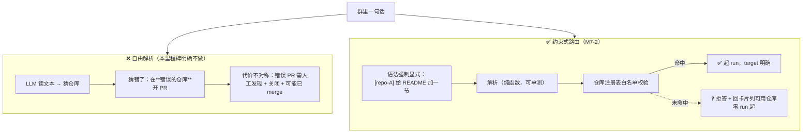
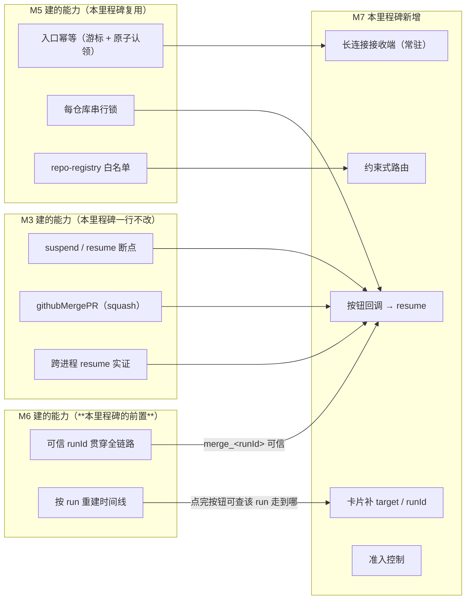

# M7 · 飞书双向控制 —— 数据流向图

> 配套卡片：[`M7-飞书双向控制.md`](./M7-飞书双向控制.md)
> 本图重点画三件事：**两条 inbound 通路（消息 vs 按钮回调）**、**人工闸门从「HTTP 手工 resume」换成「群里点按钮」**、
> **约束式路由的安全边界**。
> 与 M6 的关键差异：编排层八步与 `suspend` 断点**完全不变**，变的只是**触发方与唤醒方**。

---

## 1 总览：M7 的数据流向

```mermaid
flowchart TB
    subgraph FEISHU["飞书侧（云端）"]
        USER["👤 群成员<br/>发一句话"]
        CLICK["👤 群成员<br/>点卡片按钮"]
        EV1["im.message.receive_v1"]
        EV2["card.action.trigger"]
    end

    subgraph RECV["★M7-1 本机接收端（无公网入口 → 长连接）"]
        WS["长连接客户端<br/>重连(指数退避) / 优雅退出<br/>需先拍板: 官方 SDK vs 自写"]
    end

    subgraph ROUTE["★M7-2 约束式路由（安全边界）"]
        PARSE["解析：必须显式仓库<br/>[repo-A] 或 @repo-A"]
        CHECK["仓库注册表白名单<br/>repoKey 存在性"]
        REJECT["❓ 拒答<br/>零 run 起<br/>回卡片列可用仓库"]
    end

    subgraph AUTH["★M7-7 准入控制"]
        WHO["触发者 / 审批者身份校验"]
        DENY["🚫 审计事件 auth:deny<br/>零 run 起"]
    end

    subgraph ENTRY["★M7-3 入口分流（现在只起 insight）"]
        MAP["一句话 →<br/>issueNumber / issueTitle / issueBody / target"]
        START["createRun().start()<br/>★起 dev-workflow"]
        INS["insight-workflow<br/>(保留为独立命令)"]
    end

    subgraph ORCH["编排层 dev-workflow（八步拓扑不变）"]
        C1["1. checkout → 2. coding → 3. test →<br/>4. review → 5. commit → 6. push-open-pr"]
        C7["7. notify<br/>★M7-5 卡片含 仓库/base/runId/PR"]
        C8["8. merge ⏸ suspend<br/>waitingFor: merge-approval"]
        C9["8'. merge 执行"]
    end

    subgraph CALLBACK["★M7-4 回调 → resume"]
        CB["解析 callback_id<br/>merge_&lt;runId&gt; / reject_&lt;runId&gt;"]
        REBUILD["createRun(&#123; runId &#125;)<br/>重建 run 对象"]
        RESUME["resume(&#123; approved &#125;)"]
    end

    subgraph STORE["持久化（M5/M6 已建，本里程碑复用）"]
        DB[("LibSQLStore<br/>mastra_workflow_snapshot<br/>跨进程 resume 的前提")]
        DEDUP[("pr_agent_seen_events<br/>幂等认领 + 游标")]
        LOCK[("repo-lock<br/>每仓库串行")]
    end

    LOG["★M6 日志（可信 runId 贯穿全链路）"]

    USER --> EV1 --> WS
    CLICK --> EV2 --> WS
    WS --> PARSE
    WS --> WHO
    PARSE --> CHECK
    CHECK -->|已知仓库| MAP
    CHECK -.->|未知 / 缺失| REJECT
    WHO -->|授权| MAP
    WHO -.->|未授权| DENY
    MAP --> START
    START --> C1
    MAP -.-> INS
    C1 --> C7 --> C8
    C7 -.->|卡片推群| FEISHU
    C8 -.->|快照| DB
    START -.->|幂等认领| DEDUP
    C1 -.->|串行锁| LOCK
    C8 -.->|等待人工| CLICK
    CB --> REBUILD --> RESUME --> C9
    CB -.->|卡片重定向| WS
    RESUME <-.->|按 runId 恢复上下文| DB
    C9 -.-> LOG
    C1 -.-> LOG
```



---

## 2 两条 inbound 通路：M5 做了一条，M7 补另一条

> 📌 这是「孤儿项」的技术根源 —— **两条通路长得像，但不是一回事。**

```mermaid
flowchart TB
    subgraph M5A["M5a 已做 ✅（轮询：消息 → 起 run）"]
        direction TB
        P1["POST /api/insights/feishu-poll<br/>（**手动打**，无常驻）"]
        P2["pollInboundOnce()<br/>游标 + 原子认领"]
        P3["fetchMessages<br/>= feishuListMessages（拉群历史消息）"]
        P4["startRun<br/>❗硬编码 insight-workflow"]
        P5["去重键 = messageId<br/>重复触发不重复消耗"]
        P1 --> P2 --> P3
        P2 --> P4
        P2 --> P5
    end

    subgraph M7NEW["M7 要补 ❌（事件推送：按钮 → 唤醒 run）"]
        direction TB
        Q1["card.action.trigger<br/>（**推送**，需长连接常驻）"]
        Q2["解析 callback_id<br/>= merge_&lt;runId&gt;"]
        Q3["createRun(&#123; runId &#125;) + resume"]
        Q4["唤醒 **已存在** 的挂起 run"]
        Q1 --> Q2 --> Q3 --> Q4
    end

    M5A -.->|"看似同类，实则不同：<br/>M5a 是 **创建** run（入口）"| M7NEW
    M7NEW -.->|"M7 是 **唤醒** run（闸门）"| M5A
```



| | M5a（已做） | M7（本里程碑） |
|---|---|---|
| 通路形态 | **轮询**（主动拉） | **事件推送**（被动收） |
| 常驻要求 | 无（手动打端点） | **必须常驻**（长连接） |
| 作用对象 | **创建** run | **唤醒**已挂起的 run |
| 核心状态 | 游标 + 幂等认领 | runId → run 对象重建 |
| 失败模式 | 重复消耗 LLM | **点错 run / 假驱动** |

> ⚠️ 前四张卡写「按钮回调推迟到 M5」，但 **M5 卡全文只承接了左栏**。
> 这是「不做项」跨里程碑漂移的典型后果：**看起来有人负责，实际无人承接。**

---

## 3 约束式路由：为什么不能用「LLM 自由解析」（安全边界）



**四条负向用例（AC-2 的判据来源）**：

| 输入 | 预期 |
|---|---|
| `帮我改点东西`（无仓库标识） | 拒答，零 run |
| `[repo-Z] 改点东西`（未知仓库） | 拒答 + 列出可用仓库，零 run |
| `[repo-A]`（只有标识，没需求） | 拒答，零 run |
| `@bot`（只有提及，没内容） | 拒答，零 run |

> 📌 **判据必须可数**：断言的是 `triggered.length === 0`（**起了几个 run**），
> 而不是「看起来没执行」—— 后者正是「假驱动」的盲区。

---

## 4 人工闸门：从「手工 HTTP」到「群里点按钮」（核心交付）

```mermaid
sequenceDiagram
    autonumber
    participant U as 👤 群成员
    participant FS as 飞书云端
    participant WS as ★M7-1 长连接接收端
    participant WF as dev-workflow
    participant DB as LibSQLStore
    participant GH as GitHub

    Note over U,GH: 【M3/M4/M5 现状】人工确认靠手工打 POST /api/workflows/<wf>/resume?runId=xxx

    U->>FS: [pr-agent-e2e] 给 README 加一节快速开始
    FS->>WS: im.message.receive_v1
    WS->>WS: ★M7-7 准入校验 + ★M7-2 路由校验（失败即拒答）
    WS->>WF: ★M7-3 createRun().start()（带 target）
    WF->>GH: push 分支 + 开 PR
    WF->>DB: 写 snapshot（含 runId + 上下文）
    WF->>FS: ★M7-5 卡片：仓库 / base / runId / PR 链接<br/>按钮 value = merge_&lt;runId&gt;
    Note over WF: 8. merge ⏸ suspend（等人）

    U->>FS: 点「🔀 合并」
    FS->>WS: card.action.trigger（action.value 为 JSON 对象）
    WS->>WS: ★M7-4 校验 value &#123;kind,action,runId,repoKey&#125;（**不是 issueNumber**）
    WS->>DB: 按 runId 取回 run
    WS->>WF: createRun(&#123; runId &#125;).resume(&#123; approved: true &#125;)
    WF->>GH: squash merge
    WF->>FS: 卡片更新为「已合并」

    Note over U,GH: 全程人只在群里点了一下 —— 没有 curl、没有手工 resume
```

> 📌 **为什么按钮 value 里必须是 `runId` 而不是 `issueNumber`**：
> `issueNumber` 只在**单个仓库内**唯一，而 M5 之后系统同时服务多个仓库，且同一条需求可被重跑多次。
> `merge_5` 在「A 仓库的 #5」与「B 仓库的 #5」之间**无法区分** → 回调会 resume 到错误的 run。
> **`runId` 全局唯一 —— 这正是 M6 的 runId 穿线的下游价值所在。**
>
> 📌 **为什么是结构化 value 而不是任何分隔符**（2026-09-17 拍板）：
> `value` 在飞书侧**本就是 JSON 对象**（官方约束：「仅支持 key-value 形式的 JSON 结构，且 key 为 String 类型」），
> 所以 `merge_<runId>` 这种拼接是**自造的**，不是接口要求。
> 拼接还会把「**哪个 run**（身份，用于定位）」与「**哪个动作**（意图，用于分支）」压进同一个 token ——
> 两段语义消费方式不同，不该编在一起（与 M6 已修的 `stageStart('merge','rejected')` 同构）。
> 结构化之后，**分词、字符集、唯一性三个问题同时消失**（也顺带绕开冒号在 Windows 文件名上的非法问题）。

---

## 5 与 M6 / M5 / M3 的边界



> ⚠️ **依赖顺序**：`C1 → D3` 是**硬依赖**。M6 之前，卡片上的 runId 无处可得（日志里 0/701），
> 回调只能像现在这样用 `issueNumber` 猜 —— 而在多仓库下必然猜错。
> **这是「M6 排在 M7 之前」的第一性依据，不是排期偏好。**
