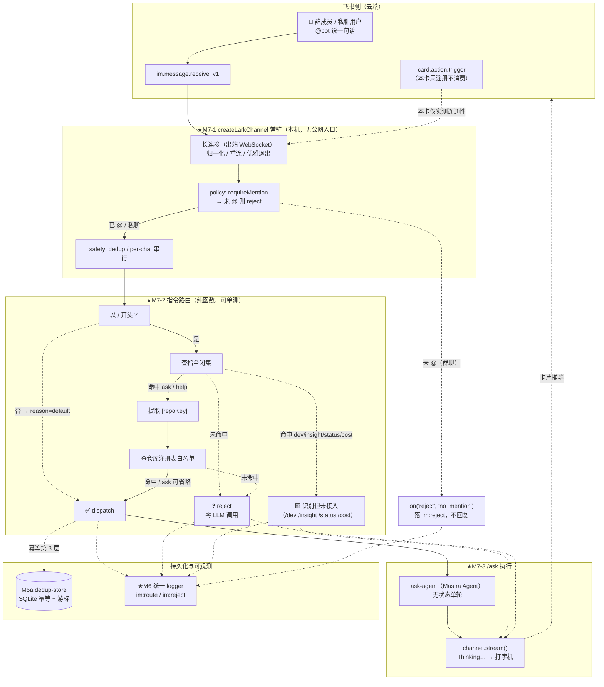
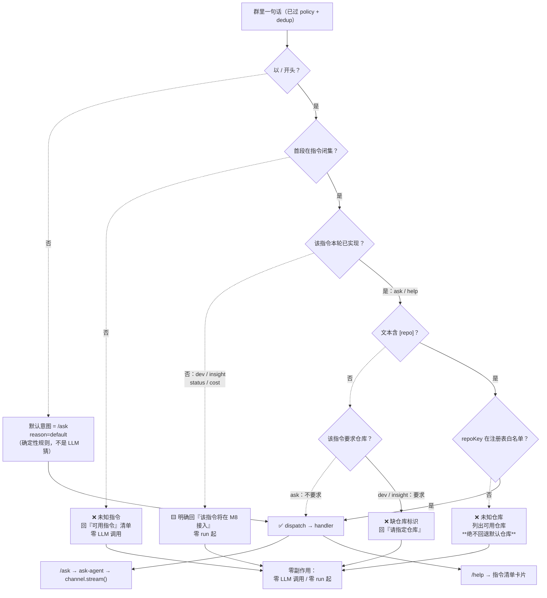
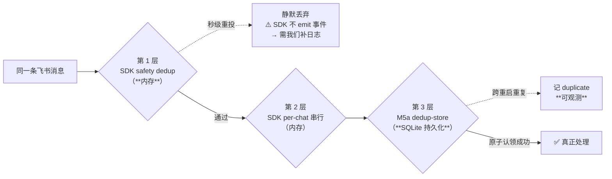
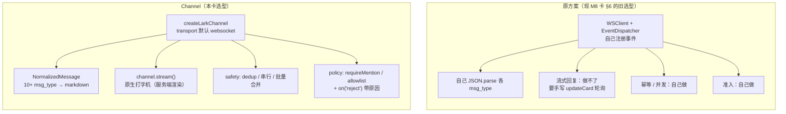
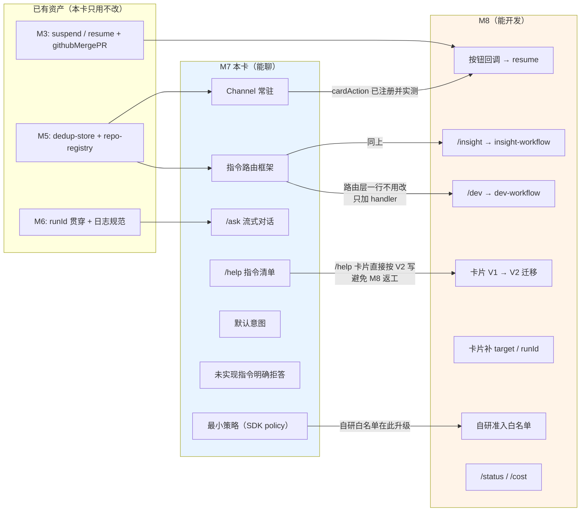

# M7 · 飞书对话入口 —— 数据流向图

> 配套卡片：[`M7-飞书对话入口.md`](./M7-飞书对话入口.md)
> 本图重点画四件事：**Channel 常驻通路**、**指令路由决策树（含拒绝路径）**、
> **三层幂等的分工**、**与 M8 的边界（本卡不碰 workflow）**。
> 📌 与 M1–M6 的关键差异：**本图没有任何 workflow 节点** —— 这是刻意的，M7 是纯入口层。

---

## 1 总览：M7 的数据流向

---

## 2 指令路由决策树（本卡第一交付物）

> 📌 **先把协议表定全，实现只落 1 条** —— 这是「先编排好」的字面落地。
> 后续接 dev / insight 时，只往注册表里加 handler，**决策树本身不动**。

| 指令 | 语法 | 仓库 | 本卡状态 | 去向 |
|---|---|---|---|---|
| `/ask` | `/ask [<repo>] <问题>` | 可选 | ✅ **实现** | `ask-agent` 通用对话（流式） |
| `/help` | `/help` | — | ✅ **实现** | 回指令清单卡片 |
| （无指令） | `<任意文本>` | — | ✅ **实现** | 默认 → `/ask` |
| `/dev` | `/dev [<repo>] <需求>` | **必填** | 🟨 识别但拒绝执行 | M8 → `dev-workflow` |
| `/insight` | `/insight [<repo>] <问题 \| #issue>` | **必填** | 🟨 识别但拒绝执行 | M8 → `insight-workflow` |
| `/status` | `/status [#<runId>]` | — | 🟨 识别但拒绝执行 | M8 → M6 日志时间线 |
| `/cost` | `/cost [<repo>]` | 可选 | 🟨 识别但拒绝执行 | M8 → M6 成本归口 |

**为什么 `/ask` 的仓库可选，而 `/dev` 必填**：通用问答常与仓库无关（「这个项目怎么跑」）；
而 `/dev` 一旦路由错，代价是**在错误的仓库开 PR** —— 不对称，所以必须显式（同 M5 §3 论证）。

---

## 3 三层幂等：SDK 两层 + M5a 一层，各管一段

> ⚠️ **这节是防止「重复建设」与「误删」的关键** —— 看到 SDK 自带 dedup 就删掉 M5a 的去重，会丢掉跨重启能力。

| 层 | 提供方 | 挡什么 | 生命周期 | 可观测性 |
|---|---|---|---|---|
| 1 | SDK `safety` | 长连接**秒级重投** | 进程内 | ⚠️ 静默（官方明示：只有 policy 拒绝才 emit `reject`） |
| 2 | SDK `safety` | 同会话并发 | 进程内 | 静默 |
| 3 | **M5a（我方）** | **跨重启重复** | **持久化** | ✅ 落 `duplicate` 事件 |

> 📌 **职责划分**：SDK 两层是「免费的防线」，M5a 那层是「唯一跨进程有效的防线」。
> M7 的 AC-8 断言的是**第 3 层**（可数），因为第 1 层静默、不可数。

---

## 4 为什么从 `WSClient` 上移到 `Channel`

| 能力 | `WSClient` | `Channel` |
|---|---|---|
| 消息解析 | 自己按 `msg_type` 分支 | `NormalizedMessage` 已归一化 |
| 流式回复 | ❌ 做不了 | ✅ `channel.stream()` |
| 卡片更新 | 手拼 JSON + 自己调 API | `channel.updateCard(messageId, card)` |
| 防重投 / 并发 | 自己写 | `safety` |
| 准入 | 自己写 | `policy` + `reject` 事件 |
| 自动降级 | 无 | 回复目标被撤回 → 转为新消息；post 被拒 → 转纯文本 |
| 逃生舱 | — | `channel.rawClient` 直调 Open API |

> 📌 官方给出的取舍线：「需要对话式 bot 能力（流式、卡片交互、媒体、@ 策略）→ 用 `Channel`；
> 只需收几个事件做简单处理 → `WSClient` 就够。」**本项目属前者。**

---

## 5 与 M8 的边界（本卡刻意不越过的那条线）

> 📌 **为什么这条线要画清楚**：M7 的失败模式是「**接错端口**」（消息收到但路由错 / 没有回话），
> M8 的失败模式是「**静默驱动错误**」（在错仓库开 PR / resume 错 run）。
> 两者风险性质不同、验收方式也不同 —— 搅在一起会说不清是哪一层的问题。
>
> 📌 **依赖顺序**：M7 **不依赖 M6**，可立即开工；M8 依赖 M6 的 runId 贯穿（原「M6 → M7 硬依赖」已更正为「M6 → M8」）。
