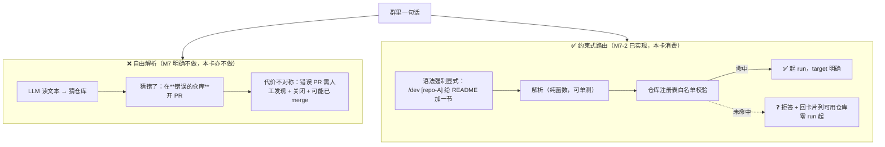
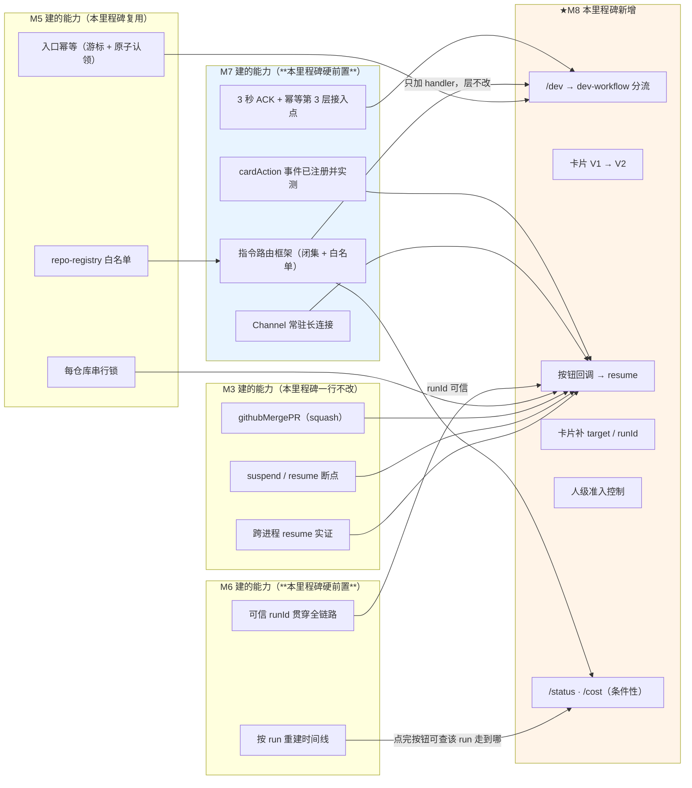

# M8 · 飞书双向控制 —— 数据流向图

> 配套卡片：[`M8-飞书双向控制.md`](./M8-飞书双向控制.md)
> 本图重点画五件事：**两条 inbound 通路（消息 vs 按钮回调）**、**人工闸门从「HTTP 手工 resume」换成「群里点按钮」**、
> **约束式路由的安全边界**、**卡片 V1→V2 迁移**、**M7 已建与本卡新增的边界**。
> 与 M6 的关键差异：编排层八步与 `suspend` 断点**完全不变**，变的只是**触发方与唤醒方**。
> 📌 与 M7 的差异：M7 解决「**收得到 + 路由对**」，本卡解决「**路由之后能真驱动一个 run，并把它从 suspend 叫醒**」。

---

## 1 总览：M8 的数据流向

```mermaid
flowchart TB
    subgraph FEISHU["飞书侧（云端）"]
        USER["👤 群成员<br/>/dev [repo-A] 需求"]
        CLICK["👤 群成员<br/>点卡片按钮"]
        EV1["im.message.receive_v1"]
        EV2["card.action.trigger"]
    end

    subgraph M7LAYER["★M7 已建（本卡一行不改）"]
        WS["Channel 常驻长连接<br/>重连 / 优雅退出"]
        PARSE["指令路由（纯函数）<br/>闭集 + 仓库白名单"]
        REJECT["❓ 拒答<br/>零 run 起<br/>回卡片列可用仓库"]
    end

    subgraph ENTRY["★M8-1 入口分流（现在只起 insight → 要起 dev）"]
        MAP["一句话 + repoKey →<br/>issueNumber / issueTitle / issueBody / target"]
        START["createRun().start()<br/>★起 dev-workflow"]
        INS["insight-workflow<br/>(保留为独立命令)"]
    end

    subgraph ORCH["编排层 dev-workflow（八步拓扑不变）"]
        C1["1. checkout → 2. coding → 3. test →<br/>4. review → 5. commit → 6. push-open-pr"]
        C7["7. notify<br/>★M8-4 卡片含 仓库/base/runId/PR"]
        C8["8. merge ⏸ suspend<br/>waitingFor: merge-approval"]
        C9["8'. merge 执行"]
    end

    subgraph CARD["★M8-2 卡片 V1 → V2（按钮可点的硬前提）"]
        V2["behaviors: [&#123; type: 'callback', value &#125;]<br/>取代 V1 的 elements[].tag='action'"]
    end

    subgraph CALLBACK["★M8-3 回调 → resume"]
        CB["schema 校验<br/>value = &#123;kind, action, runId, repoKey&#125;"]
        REBUILD["createRun(&#123; runId &#125;)<br/>重建 run 对象"]
        RESUME["resume(&#123; approved &#125;)"]
    end

    subgraph STORE["持久化（M5/M6 已建，本里程碑复用）"]
        DB[("LibSQLStore<br/>mastra_workflow_snapshot<br/>跨进程 resume 的前提")]
        DEDUP[("pr_agent_seen_events<br/>幂等认领 + 游标")]
        LOCK[("repo-lock<br/>每仓库串行")]
    end

    LOG["★M6 日志（可信 runId 贯穿全链路）"]

    USER --> EV1 --> WS
    CLICK --> EV2 -.->|"M7 已注册并实测连通<br/>本卡开始消费"| WS
    WS --> PARSE
    PARSE -->|"dispatch(dev)"| MAP
    PARSE -.->|"未知指令 / 未知仓库"| REJECT
    MAP --> START
    START --> C1
    MAP -.-> INS
    C1 --> C7 --> C8
    C7 --> V2
    V2 -.->|"卡片推群"| FEISHU
    C8 -.->|快照| DB
    START -.->|幂等认领| DEDUP
    C1 -.->|串行锁| LOCK
    C8 -.->|等待人工| CLICK
    EV2 --> CB --> REBUILD --> RESUME --> C9
    RESUME <-.->|按 runId 恢复上下文| DB
    C9 -.->|"updateCard：已合并"| FEISHU
    C9 -.-> LOG
    C1 -.-> LOG
```

---

## 2 两条 inbound 通路：M5 做了一条，M7 换了入口，M8 补最后一条

> 📌 这是「孤儿项」的技术根源 —— **三条通路长得像，但不是一回事。**

```mermaid
flowchart TB
    subgraph M5A["M5a 已做 ✅（轮询：拉消息 → 起 run）"]
        direction TB
        P1["POST /api/insights/feishu-poll<br/>（**手动打**，无常驻）"]
        P2["pollInboundOnce()<br/>游标 + 原子认领"]
        P3["fetchMessages<br/>= feishuListMessages（拉群历史消息）"]
        P4["startRun<br/>❗硬编码 insight-workflow"]
        P5["去重键 = messageId<br/>重复触发不重复消耗"]
        P1 --> P2 --> P3
        P2 --> P4
        P2 --> P5
    end

    subgraph M7NEW["M7 已做 ✅（长连接：推送消息 → 路由 → 回答）"]
        direction TB
        N1["card-less：im.message.receive_v1<br/>（**推送**，长连接常驻）"]
        N2["NormalizedMessage<br/>免手解析 10+ msg_type"]
        N3["指令路由（闭集 + 白名单）"]
        N4["/ask → 流式回答<br/>（**只聊，不起 run**）"]
        N1 --> N2 --> N3 --> N4
    end

    subgraph M8NEW["M8 要补 ❌（事件推送：按钮 → 唤醒 run）"]
        direction TB
        Q1["card.action.trigger<br/>（**推送**，M7 已实测长连接可用）"]
        Q2["schema 校验 value<br/>= &#123;kind, action, runId, repoKey&#125;"]
        Q3["createRun(&#123; runId &#125;) + resume"]
        Q4["唤醒 **已存在** 的挂起 run"]
        Q1 --> Q2 --> Q3 --> Q4
    end

    M5A -.->|"看似同类，实则不同：<br/>M5a 是 **创建** run（入口）"| M8NEW
    M8NEW -.->|"M8 是 **唤醒** run（闸门）"| M5A
    M7NEW -.->|"M7 只回答，不驱动<br/>M8 才把路由结果接到 run 上"| M8NEW
```

| | M5a（已做） | M7（已做） | **M8（本卡）** |
|---|---|---|---|
| 通路形态 | **轮询**（主动拉） | **长连接推送** | **长连接推送** |
| 常驻要求 | 无（手动打端点） | 必须常驻（已有） | 复用 M7 |
| 作用对象 | **创建** run | **只回答**，不碰 run | **唤醒**已挂起的 run |
| 核心状态 | 游标 + 幂等认领 | 路由决策 | runId → run 对象重建 |
| 失败模式 | 重复消耗 LLM | 接错端口（路由错） | **点错 run / 假驱动** |

> ⚠️ 前四张卡写「按钮回调推迟到 M5」，但 **M5 卡全文只承接了第一栏**。
> 这是「不做项」跨里程碑漂移的典型后果：**看起来有人负责，实际无人承接。**
> 📌 同样的风险在本卡分拆时又被检查了一遍 —— 原 M7 的 §0.1 五条逐条定性（见 M8 卡 §0.2），**无悬空项**。

---

## 3 约束式路由：为什么不能用「LLM 自由解析」（安全边界）

**本卡新增的两条负向用例（在 M7 四条之上）**：

| 输入 | 预期 |
|---|---|
| `/dev [repo-A]`（有仓库，无需求描述） | 拒答，零 run |
| `/dev [repo-A] #12`（引用不存在的 issue） | 拒答（或按 §0.1 第 1 条定的策略处理），零 run |

> 📌 **判据必须可数**：断言的是 `triggered.length === 0`（**起了几个 run**），
> 而不是「看起来没执行」—— 后者正是「假驱动」的盲区。

---

## 4 卡片 V1 → V2：本卡最容易低估的工作量

```mermaid
flowchart LR
    subgraph V1["❌ 现状（M3 起沿用至今）"]
        direction TB
        A1["buildCard（feishu.ts:110-132）<br/>config.wide_screen_mode"]
        A2["elements[].tag = 'action'<br/>+ actions[].tag = 'button'"]
        A3["value: &#123; callback_id: 'merge_123' &#125;"]
        A1 --> A2 --> A3
        A4["⚠️ 按钮**点不动**<br/>官方归因：v1 card schema"]
        A3 --> A4
    end

    subgraph V2["✅ 目标（★M8-2）"]
        direction TB
        B1["card_json_v2<br/>column_set → column → button"]
        B2["behaviors: [&#123; type: 'callback', value &#125;]<br/>value 为 JSON 对象"]
        B3["value: &#123; kind:'dev', action:'merge',<br/>runId, repoKey &#125;"]
        B1 --> B2 --> B3
        B4["✅ 真群点击可触发 card.action.trigger"]
        B3 --> B4
    end

    V1 -.->|"★M8-2 迁移<br/>（不是加字段，是换结构）"| V2
```

> ⚠️ **原卡（前身）把「按钮能点」当成「加个 value 字段」** —— 实际官方 common issues 明确写：
> 「Card buttons not firing is usually either a missing `card.action.trigger` subscription **or a v1 card schema**.」
> 这条是 2026-09-17 核查飞书 SDK 文档时**新发现**的隐藏工作量，已单列为缺口 8 与 AC-6。
>
> 📌 **AC-6 的判据必须是「真群点得动」**：结构断言通过 ≠ 按钮可用。
> 这正是本卡的核心失败模式（**静默**：卡片看着正常，点了没反应，也不报错）。

---

## 5 人工闸门：从「手工 HTTP」到「群里点按钮」（核心交付）

```mermaid
sequenceDiagram
    autonumber
    participant U as 👤 群成员
    participant FS as 飞书云端
    participant WS as ★M7 Channel 常驻
    participant WF as dev-workflow
    participant DB as LibSQLStore
    participant GH as GitHub

    Note over U,GH: 【M3–M7 现状】人工确认靠手工打 POST /api/workflows/<wf>/resume?runId=xxx

    U->>FS: /dev [pr-agent-e2e] 给 README 加一节快速开始
    FS->>WS: im.message.receive_v1
    WS->>WS: ★M7 路由校验（失败即拒答；本卡不改这层）
    WS->>WF: ★M8-1 createRun().start()（带 target）
    WF->>GH: push 分支 + 开 PR
    WF->>DB: 写 snapshot（含 runId + 上下文）
    WF->>FS: ★M8-2 卡片 V2 + ★M8-4 内容：仓库 / base / runId / PR 链接<br/>按钮 value = &#123;kind:'dev', action:'merge', runId, repoKey&#125;
    Note over WF: 8. merge ⏸ suspend（等人）

    U->>FS: 点「🔀 合并」
    FS->>WS: card.action.trigger（action.value 为 JSON 对象）
    WS->>WS: ★M8-3 schema 校验 &#123;kind, action, runId, repoKey&#125;（**不是 issueNumber**）
    WS->>DB: 按 runId 取回 run
    WS->>WF: createRun(&#123; runId &#125;).resume(&#123; approved: true &#125;)
    WF->>GH: squash merge
    WF->>FS: updateCard → 「已合并」

    Note over U,GH: 全程人只在群里点了一下 —— 没有 curl、没有手工 resume
```

> 📌 **为什么按钮 value 里必须是 `runId` 而不是 `issueNumber`**：
> `issueNumber` 只在**单个仓库内**唯一，而 M5 之后系统同时服务多个仓库，且同一条需求可被重跑多次。
> `merge_5` 在「A 仓库的 #5」与「B 仓库的 #5」之间**无法区分** → 回调会 resume 到错误的 run。
> **`runId` 全局唯一 —— 这正是 M6 的 runId 穿线的下游价值所在。**
>
> 📌 **为什么是结构化 value 而不是任何分隔符**（2026-09-17 拍板）：
> `value` 在飞书侧**本就是 JSON 对象**（官方约束：「仅支持 key-value 形式的 JSON 结构，且 key 为 String 类型」），
> 所以 `merge_<runId>` 这种拼接是**自造的**，不是接口要求。
> 拼接还会把「**哪个 run**（身份，用于定位）」与「**哪个动作**（意图，用于分支）」压进同一个 token ——
> 两段语义消费方式不同，不该编在一起（与 M6 已修的 `stageStart('merge','rejected')` 同构）。
> 结构化之后，**分词、字符集、唯一性三个问题同时消失**（也顺带绕开冒号在 Windows 文件名上的非法问题）。

---

## 6 与 M7 / M6 / M5 / M3 的边界

> ⚠️ **依赖顺序**：`C1 → D3` 与 `E2 → D1` 都是**硬依赖**。
> - M6 之前，卡片上的 runId 无处可得（日志里 0/701），回调只能像现在这样用 `issueNumber` 猜 —— 多仓库下必然猜错。
> - M7 之前，没有路由层与常驻通路，本卡要么自建（返工），要么无入口。
>
> **这是「M6、M7 排在 M8 之前」的第一性依据，不是排期偏好。**
> 📌 注意 **M7 不依赖 M6** —— M7 只做对话，不需要 runId 贯穿。
> 原表述「M6 → M7 硬依赖」已更正为「M6 → M8」。
