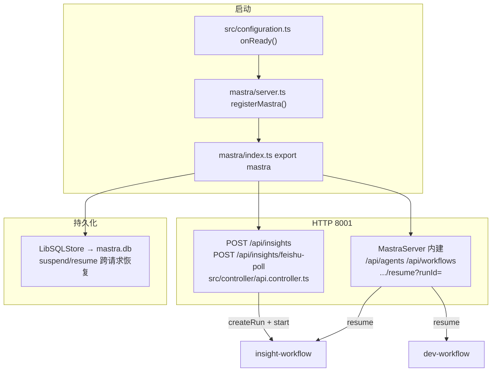
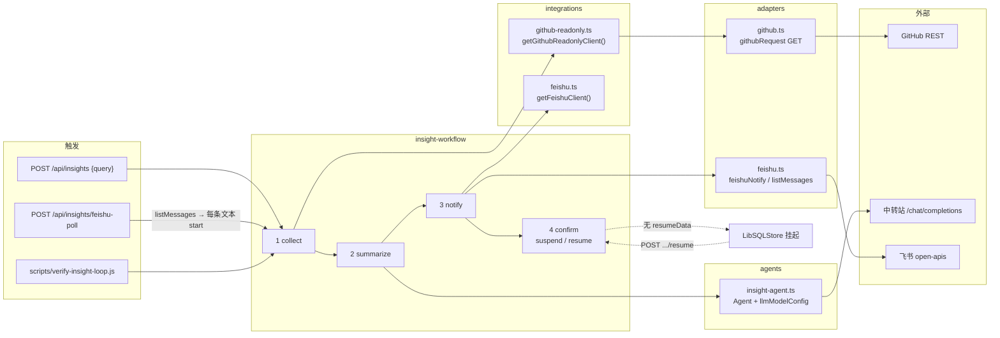
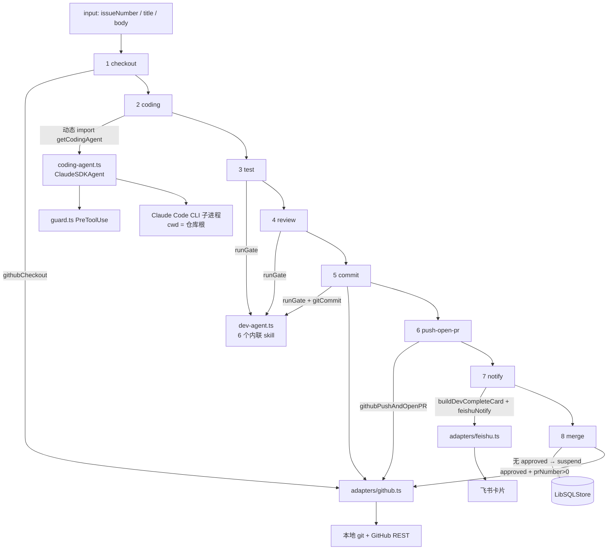
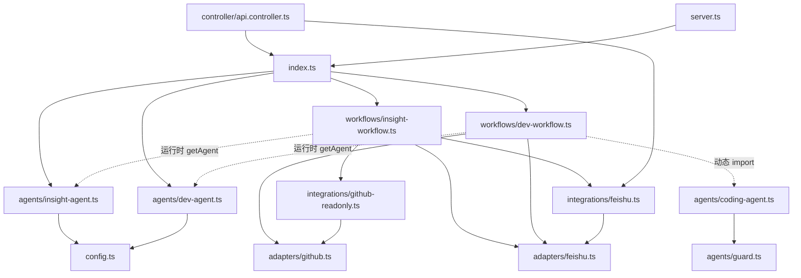

# `src/mastra/` — 目录地图与引用关系

> 本文件只回答一件事：**这个目录里每个文件干什么、被谁调用、关键代码在哪。**
> Mastra API 写法（`createStep` / `.then().commit()` / storage 必配）以仓库根 `agent.md` §2.1 为准，这里不重复。
>
> 读完应能：改某个 step 时知道该动哪一层；看一张图就能顺着「HTTP → workflow → agent/adapter」把调用链走到底。

---

## 0. 一句话分层

```
HTTP / 脚本
    │
    ▼
index.ts  (唯一 Mastra 实例 + LibSQLStore)
    │
    ├── workflows/     编排（强制顺序 + suspend/resume）
    ├── agents/        思考（LLM / Claude Code CLI）
    ├── skills/        闸门说明书（SKILL.md 存档；运行时以内联 createSkill 为准）
    ├── integrations/  Mastra Integration 包装（工具 + client 工厂）
    └── adapters/      真正打外部系统（GitHub REST / 本地 git / 飞书 HTTP）
```

**adapters 做事，integrations 包装，workflows 编排，agents 思考。** 不要在 workflow 里直接 `fetch` 飞书/GitHub——那是 adapter 的活。

---

## 1. 目录与文件一览

| 路径 | 职责 | 谁引用它 |
|---|---|---|
| `index.ts` | 装配唯一 `mastra` 实例；注册 agent / workflow；配 LibSQLStore | `server.ts`、`src/controller/api.controller.ts`、`npx mastra dev`、测试 / 验证脚本 |
| `server.ts` | 把 Midway 的 Koa app 交给 `@mastra/koa`，挂 `/api/agents`、`/api/workflows` | `src/configuration.ts` `onReady()` |
| `config.ts` | LLM 中转站配置（`OpenAICompatibleConfig`），全环境变量 | `agents/insight-agent.ts`、`agents/dev-agent.ts` |
| `agents/insight-agent.ts` | M1 洞察汇总（只读、结构化 JSON） | `insight-workflow` 的 `summarize` 步 |
| `agents/dev-agent.ts` | 自动开发主控 + 6 个内联 skill（闸门） | `dev-workflow` 的 test / review / commit 步 |
| `agents/coding-agent.ts` | 真正写文件的编码体（Claude Code CLI） | `dev-workflow` 的 `coding` 步（**动态 import**） |
| `agents/guard.ts` | 编码体 PreToolUse 围栏（纯函数） | `coding-agent.ts` 的 `makeGuardHook` |
| `workflows/insight-workflow.ts` | M1 四步：collect → summarize → notify → confirm | `index.ts` 注册为 `insight-workflow` |
| `workflows/dev-workflow.ts` | 自动开发八步：checkout → … → merge | `index.ts` 注册为 `dev-workflow` |
| `adapters/github.ts` | 本地 git + GitHub REST（读写都在这） | 只读集成、`dev-workflow` 的 checkout / commit / push / merge |
| `adapters/feishu.ts` | 飞书推卡片 + 拉群消息（只负责「推/拉」，不负责按钮回调） | 飞书集成、两条 workflow 的 notify 步 |
| `integrations/github-readonly.ts` | GitHub 只读 Integration + 3 个 GET 工具 | `insight-workflow` collect；agent 工具入口 |
| `integrations/feishu.ts` | 飞书 Integration + 发卡片 / 拉消息工具 | `insight-workflow` notify 判空；`POST /api/insights/feishu-poll` |
| `skills/<name>/SKILL.md` | 闸门技能的规范存档（Agent Skills spec） | 人读 / 后续若改路径加载；**运行时不读这些文件** |

---

## 2. 装配层：`index.ts` / `server.ts` / `config.ts`

### 2.1 `index.ts` — 单一真相源

导出必须叫 `mastra`（`npx mastra dev` 硬约定）。Midway 嵌入路径和 Studio 路径**共用这一份实例**，禁止再 `new Mastra(...)`。

当前注册：

```ts
agents:    { 'dev-agent', 'insight-agent' }
workflows: { 'dev-workflow', 'insight-workflow' }
storage:   LibSQLStore({ url: `file:${absPath}` })
```

**为什么 storage 不是可选项：** confirm / merge 步 `suspend()` 之后，resume 是另一次 HTTP 请求，手里只有 `runId`。不配持久化 storage，按 runId 重建 run 会报 `This workflow run was not suspended`（`test/mastra/storage.test.ts` 守护）。数据库路径必须是绝对路径，否则 `mastra dev` 与 `npm start` 两个进程会各写一份 `mastra.db`。

`coding-agent` **没有**注册进 `agents`——它是 Claude Code CLI 封装，由 coding 步动态 `import`，避免启动时把 ESM 依赖拉进 jest / Midway。

### 2.2 `server.ts` — Midway 嵌入

`registerMastra(app)` 用 `@mastra/koa` 的 `MastraServer` 接管 Koa app，自动注册：

- `GET  /api/agents`
- `GET  /api/workflows`
- `POST /api/workflows/:workflowId/create-run`
- `POST /api/workflows/:workflowId/start-async`
- `POST /api/workflows/:workflowId/resume?runId=`
- `GET  /api/workflows/:workflowId/runs` 与 `/runs/:runId`

唯一允许的 `as any`：Midway 的 `koa.Application` 与标准 Koa 类型对不上，运行期兼容。接入点是 `src/configuration.ts` 的 `onReady()`。

业务入口（`POST /api/insights`）**不在** MastraServer 里，而在 `src/controller/api.controller.ts`。

### 2.3 `config.ts` — LLM 中转

不用 `'openai/<model>'` 字符串（那走 Responses API，中转站基本不兼容），用 `OpenAICompatibleConfig` → `/chat/completions`。

| env | 作用 |
|---|---|
| `LLM_PROVIDER` | 标识，默认 `relay` |
| `LLM_MODEL` | 中转站模型名（必填才真正能 generate） |
| `LLM_BASE_URL` | 含 `/v1` |
| `LLM_API_KEY` | 中转站密钥 |

**加载时不抛错**：`npm test` 会 require 本模块，`GET /api/agents` 只列元数据。缺配置推迟到 `agent.generate()`。提前自检用 `missingLlmConfig()`。

---

## 3. agents/ — 三类「思考体」，别混

| 文件 | 类型 | 干什么 | 不干什么 |
|---|---|---|---|
| `insight-agent.ts` | `@mastra/core/agent` 的 `Agent` | 把 issue/commit 原文汇总成 `{highlights, risks, suggestions}` | 不拉 GitHub、不发飞书 |
| `dev-agent.ts` | 同上 + 6 个内联 skill | 质量闸门（测试 / 审核 / commit message） | **不写文件**（写文件是 coding-agent） |
| `coding-agent.ts` | `@mastra/claude` 的 `ClaudeSDKAgent` | 在目标仓库真正 Read/Write/Bash | 不负责闸门判定 |
| `guard.ts` | 纯函数，零 IO | PreToolUse 拦截危险命令 / 受保护路径 | 不 import SDK |

### 3.1 `insight-agent.ts`

`instructions` 约束只基于提供的数据分析、中文输出。model 来自 `llmModelConfig`。workflow 侧用 **plain generate + 抽 JSON**（当前中继不支持 Mastra `structuredOutput`，见 insight-workflow 注释）。

### 3.2 `dev-agent.ts`

6 个 skill **全部 `createSkill({...})` 内联**，不走 `'./skills/<name>'` 路径——构建后 cwd 解析基准不确定。`SKILL.md` 是规范存档，改行为要改这里的 `instructions`，并同步 SKILL.md。

skill 与 workflow 步的对应：

| 内联 skill | 被哪一步 `runGate()` 调用 | 结构化输出 |
|---|---|---|
| `requirement-parser` | （尚未串进 workflow，入口预留） | 标题 / 正文 |
| `coding` | **未被 coding 步使用** | — |
| `code-testing` | `test` | `{ passed, report }` |
| `code-review` | `review` | `{ decision, comments }` |
| `commit-message` | `commit` | `{ message, lintPassed }` |
| `merge-pr` | **未被 merge 步使用**（merge 走 REST squash） | — |

`coding` / `merge-pr` 两个 skill 目前是说明书 + 主控 instructions 的一部分，真正落地分别是 `ClaudeSDKAgent` 和 `githubMergePR()`。不要看到 skill 名就以为那一步在调它。

### 3.3 `coding-agent.ts` 关键点

- **动态 import** `@mastra/claude`：静态 import 会在 jest 里炸掉（ESM `sdk.mjs`）。
- 权限三层，**真正硬拦截只有第三层**：
  1. `permissionMode: 'bypassPermissions'` + `allowDangerouslySkipPermissions`（无人值守，否则 Bash 缺 TTY 卡死）
  2. `allowedTools` / `disallowedTools`（bypass 下不具约束力，防御纵深；断掉 WebFetch/WebSearch）
  3. **PreToolUse hook → `guard.ts`**（与 permissionMode 无关）
- `sdkOptions.env` 一旦设置会**整个替换**子进程环境，必须 `...process.env` 再覆盖 `ANTHROPIC_*`。
- `maxTurns` / `maxBudgetUsd` 是成本上限，env 可覆盖。

### 3.4 `guard.ts` 关键点

fail-closed 纯函数。拦截两类：

- **写工具**（Write / Edit / MultiEdit / NotebookEdit）：路径归一化后命中 `PROTECTED_PATHS` 或逃出仓库 → deny
- **Bash**：12 条危险命令（force push、直推 main、`rm -rf`、写 `.git/`、`gh pr merge` 等）+ shell 重定向写入受保护路径

受保护路径：`agent.md`、`.github/**`、`.env*`、`src/mastra/workflows/**`、`src/mastra/agents/**`。自举期禁止 agent 改自己的行为约束。

---

## 4. adapters/ vs integrations/ — 为什么有两层

| | adapters | integrations |
|---|---|---|
| 依赖 | `fetch` / `child_process` / `fs`，**不依赖** `@mastra/core/integration` | 依赖 `Integration` + `createTool` |
| 职责 | 真正的副作用（推卡片、建分支、开 PR） | 把 adapter 收成 Mastra 对象：工具给 agent 用，client 给 workflow 用 |
| 加载 | 缺 env **不抛错**，调用时返回 null / `{ok:false}` | 同左，`getXxxClient()` 返回 null |
| 现在谁在用 | workflow 步**直接调函数**（主路径） | `getXxxClient()` 判空；工具集给未来 agent 用，workflow 目前没走 tool 抽象 |

改飞书签名 / GitHub REST 字段 → 动 adapter。给 agent 加一个「列 issue」工具 → 动 integration。

### 4.1 `adapters/github.ts` 重要代码

| 导出 | 作用 | 被谁用 |
|---|---|---|
| `getGithubConfig()` / `missingGithubConfig()` | token + owner/repo（可从 `git remote` 解析） | 全体 GitHub 调用 |
| `githubRequest()` | 统一 REST，非 2xx 抛带 status 的错 | 只读集成 + 开 PR / merge |
| `githubCheckout()` | 建 `feat/<n>-<slug>` 并切过去 | dev-workflow `checkout` |
| `gitCommit()` | `git add -A` + commit + **ref 落盘校验** | dev-workflow `commit` / push 兜底 |
| `githubPushAndOpenPR()` | token 内嵌 HTTPS push + REST 开 PR（已有 open PR 则复用） | `push-open-pr` |
| `githubMergePR()` | REST squash merge | `merge` |

本环境 PortableGit 有 **ref-not-flushed** 顽疾：`git branch` / `git commit` 可能 exit 0 但不写 `.git/refs/heads/<branch>`。`createBranchVerified` + `ensureRefFlushed` 用 `mkdir` + 直接写 ref 文件兜底。**不要改回 `git checkout -b`**，会把仓库弄成 unborn，下一次 `git add -A` 把整棵工作树提交成孤儿 commit。

不依赖 `gh` CLI（跨平台、本机无 Homebrew）。

### 4.2 `adapters/feishu.ts` 重要代码

两种模式，**webhook 优先**：

1. `FEISHU_WEBHOOK_URL`（+ 可选签名 `FEISHU_WEBHOOK_SECRET`）
2. 自建应用：`FEISHU_APP_ID` + `FEISHU_APP_SECRET` + `FEISHU_RECEIVE_ID`

| 导出 | 作用 |
|---|---|
| `feishuNotify()` | 推 interactive 卡片；未配置返回 `{ok:false}` 不抛 |
| `buildCard()` / `buildDevCompleteCard()` | 卡片结构；按钮 `value.callback_id` 透传 `confirm_<runId>` / `merge_<n>` |
| `feishuListMessages()` | 自建应用轮询群消息（webhook 机器人无读权限） |
| `getTenantAccessToken()` | token 缓存，提前 60s 过期刷新 |

**明确不做 inbound：** 按钮点下去飞书要打公网回调或走 WebSocket 长连接。本 adapter 只「推」。点按钮报「目标回调服务当前未在线」是预期，resume 走 HTTP 端点（M1）或待 M5 接长连接。

### 4.3 `integrations/github-readonly.ts`

三个只读工具：`listIssues` / `getIssue` / `listCommits`，全部 GET。`listIssues` 会把 GitHub 混在 issues 端点里的 PR 滤掉（`!i.pull_request`）。

workflow collect 步走 `getGithubReadonlyClient()` 直接调 client，不绕 tool。

### 4.4 `integrations/feishu.ts`

两个工具：`feishu-send-card` / `feishu-list-messages`。`getFeishuClient()` 未配置返回 null——insight-workflow notify 据此跳过发卡片。

---

## 5. workflows/ — 两条流水线

共同写法（`agent.md` §2.1）：

- `createStep({ id, description, inputSchema, outputSchema, execute })`，禁止 `new Step`
- `new Workflow({ id, inputSchema, outputSchema }).then(...).commit()`
- 共享 Context schema 贯穿全流程，每步 spread 后填新字段
- `mastra` 不在 Workflow 构造里传入，由 `new Mastra({ workflows })` 注入
- 外部依赖缺失 → 跳过 / 降级，**不阻断**后续 suspend（人工关卡必须还能走到）

### 5.1 `insight-workflow.ts`（M1，已验证）

四步强制顺序：

| # | step | 调谁 | 失败/缺失时 |
|---|---|---|---|
| 1 | `collect` | `getGithubReadonlyClient()` → `listIssues` + `listCommits` | 未配置 → 空数组 |
| 2 | `summarize` | `mastra.getAgent('insight-agent')` + `generateInsight`（超时 / 重试 / 抽 JSON） | 耗尽重试 → 空洞察 + `llmUnavailable=true` |
| 3 | `notify` | `getFeishuClient()` 判空；`feishuNotify()` 发卡片，按钮 `confirm_<runId>` / `rerun_<runId>` | 未配置或推送失败 → `cardSent=false` |
| 4 | `confirm` | 无 resumeData → `suspend({ waitingFor: 'insight-confirm', runId })` | resume 后写 `feedback`：`confirmed` / `rerun` / `dismissed` |

`generateInsight` 是本文件最重要的防护：中继可能挂起 >30s，Mastra `generate` 无默认网络超时，不加 `AbortController` 整条闭环会冻死。默认 `M1_LLM_TIMEOUT_MS=45000`、`M1_LLM_ATTEMPTS=3`。

HTTP 触发：`POST /api/insights` `{ query }` → `createRun` + `start`，返回 `{ runId, status: 'suspended' }`。
Resume：`POST /api/workflows/insight-workflow/resume?runId=` body `{ "resumeData": { "approved": true } }`。

### 5.2 `dev-workflow.ts`（骨架，写路径）

八步：

| # | step | 调谁 | 备注 |
|---|---|---|---|
| 1 | `checkout` | `githubCheckout(issueNumber, title)` | 失败降级占位分支名，不抛 |
| 2 | `coding` | **动态 import** `getCodingAgent()` | 缺 Anthropic key → 占位字符串 |
| 3 | `test` | `runGate(dev-agent, code-testing, TestGateSchema)` | TODO：`passed=false` 打回 coding（条件边未做） |
| 4 | `review` | `runGate(..., code-review, ReviewGateSchema)` | TODO：`request-changes` 打回 |
| 5 | `commit` | `runGate(..., commit-message)` + `gitCommit()` | 闸门出 message，adapter 真正提交 |
| 6 | `push-open-pr` | `githubPushAndOpenPR()` | 未配置 GitHub → `prNumber=0` |
| 7 | `notify` | `buildDevCompleteCard` + `feishuNotify` | 按钮 `merge_<n>` / `reject_<n>`；失败仅告警 |
| 8 | `merge` | 无 approved → suspend；有则 `githubMergePR` | `prNumber<=0` → `merge-skipped` |

`runGate`：`agent.generate(..., { structuredOutput: { schema, errorStrategy: 'strict' } })` 读 `res.object`。与 insight 的 plain generate 不同——闸门必须能被条件边判定，不能解析自由文本。

---

## 6. skills/ — 存档，不是运行时加载点

```
skills/
  requirement-parser/SKILL.md
  coding/SKILL.md
  code-testing/SKILL.md          + references/test-checklist.md
  code-review/SKILL.md           + references/review-checklist.md
  commit-message/SKILL.md
  merge-pr/SKILL.md
```

frontmatter 必需 `name` / `description`（Agent Skills spec）。`dev-agent.ts` 用内联 `createSkill` 复制了同一份 instructions。两边不一致时，**以 `dev-agent.ts` 为准**（那才是运行时）。

---

## 7. Workflow 引用流程图

### 7.1 总装配：谁把谁挂到 HTTP 上



### 7.2 insight-workflow 引用链（M1 主路径）



读图要点：

- collect 不经过 GitHub **写** adapter（`githubCheckout` 等），只走只读 client。
- notify 同时碰 integration（判空）和 adapter（真发）。
- confirm **不调用**飞书。按钮点了飞书找不到回调服务，是 inbound 未接，不是这张图缺了一条线。

### 7.3 dev-workflow 引用链



读图要点：

- 写文件只发生在 coding 步（Claude CLI + guard）。dev-agent 的 `coding` skill 不在这条实线上。
- test / review / commit **message** 走 dev-agent；**真正 git commit / push / merge** 走 adapter。
- merge 与 insight 的 confirm 一样靠 storage 跨请求 resume。

### 7.4 模块依赖（静态 import，不含动态）



虚线 = 运行时解析（`mastra.getAgent` / 动态 `import`），不是文件顶层 import。

---

## 8. HTTP / 脚本入口对照

| 你想验证 | 打哪个 | 落到哪 |
|---|---|---|
| 列表 agent / skill | `GET /api/agents` | MastraServer → `index.ts` 的 agents |
| 列表 workflow | `GET /api/workflows` | 同上 workflows |
| 跑一条洞察 | `POST /api/insights` `{"query":"..."}` | insight-workflow start，直到 confirm suspend |
| 飞书轮询触发 | `POST /api/insights/feishu-poll` | `getFeishuClient().listMessages` → 每条 start |
| 人工确认洞察 | `POST /api/workflows/insight-workflow/resume?runId=` `{"resumeData":{"approved":true}}` | confirm 步 resume |
| 进程内闭环（不启服务） | `node scripts/verify-insight-loop.js` | 直接 `mastra.getWorkflow('insight-workflow')` |
| 人工终端确认 | `M1_MANUAL_CONFIRM=1 node scripts/verify-insight-loop.js` | start 后等 stdin 再 resume |

端口：**8001**（`src/config/config.default.ts`）。先 `npm run build` 再 `npm start`（跑的是 `dist/`）。

---

## 9. 改代码时的落点速查

| 需求 | 改这里 | 不要改那里 |
|---|---|---|
| 洞察 JSON 结构 / prompt | `insight-workflow.ts` 的 prompt + `InsightSchema`；同步 `insight-agent.ts` instructions | 不要在 collect 里调 LLM |
| LLM 超时 / 重试 | `insight-workflow.ts` `LLM_TIMEOUT_MS` / `LLM_MAX_ATTEMPTS` | 不要改 `config.ts` 来「修超时」 |
| 换中转站 | `.env` 的 `LLM_*` | 不要把 key 写进 `config.ts` |
| 飞书卡片长什么样 | `adapters/feishu.ts` `buildCard` / `buildDevCompleteCard` | workflow 只拼 markdown |
| GitHub 开 PR / merge 行为 | `adapters/github.ts` | 不要在 step 里直接 `fetch` |
| 编码体乱改 workflow / `.env` | `agents/guard.ts` `PROTECTED_PATHS` / `DANGEROUS_COMMANDS` | 不要指望 `allowedTools`（bypass 下无效） |
| 测试/审核闸门文案 | `dev-agent.ts` 内联 skill + 对应 `SKILL.md` | 只改 SKILL.md 运行时看不见 |
| 挂一条新 workflow | 新文件 + `index.ts` 的 `workflows` 字典 | 不要在 `server.ts` 里注册 |
| 让 `mastra dev` 看见状态 | 保持 `index.ts` 导出名 `mastra` + storage 绝对路径 | 不要再 new 一份 Mastra |

---

## 10. 和仓库其它文档的分工

| 文档 | 管什么 |
|---|---|
| **本文件** `src/mastra/README.md` | 目录职责、引用关系、改哪里 |
| `agent.md` | 智能体规范：API 事实、git 红线、验证纪律、权限模型 |
| `milestones/M1-*.md` | M1 验收、异常兜底、数据口径 |
| `11-` / `12-` / `13-` | 产品设计、任务列表、编码前卡点 |

发现本文件与代码不一致，以代码为准并改本文件。发现与 `agent.md` 的 API 事实冲突，以 `agent.md` §2.1（对照当前 `@mastra/core` `.d.ts`）为准。
